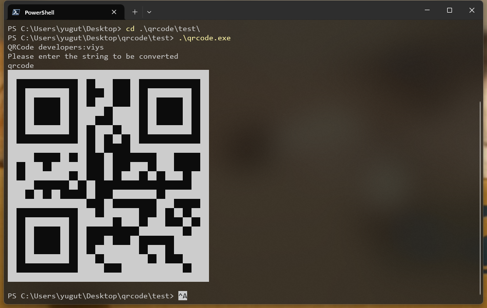
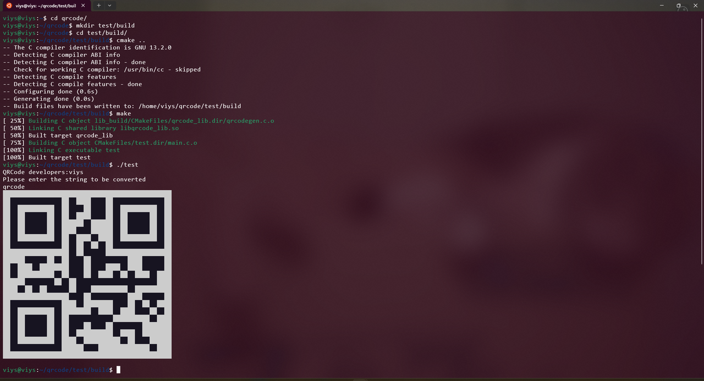

# 项目地址

https://github.com/viys/qrcode.git

# 项目介绍

串口打印二维码

## Windows



```powershell
# 代码验证
cd qrcode
mkdir .\test\build
cd .\test\build\
cmake -G "MinGW Makefiles" ..
make
.\test.exe
```

## Linux



```bash
# 代码验证
mkdir test/build/
cd test/build/
cmake ..
make
./test
```

# 项目移植

## 文件移植

将 `qrcodegen.c` 和 `qrcodegen.h` 文件移植到单片机工程中

## 库初始化

```c
// 初始化二维码串口输出
qrcode_init(printf);
```

## 打印二维码

```c
// 打印二维码, buff 为二维码内容的字符串
qr_doBasic((const char*)buff);
```

# 相关文档

- [UART](https://z1eac6eifxs.feishu.cn/wiki/TbNwwvSt6i6pxlkn3BScXrayntg?fromScene=spaceOverview#share-YHlWdlXcTo56u8xmqkZcrRH0n0c)- ANSI 转义序列