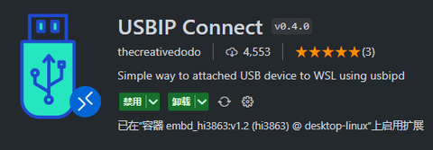

# 相关文档

https://learn.microsoft.com/zh-cn/windows/wsl/

# 多子系统管理

### 查看已安装的 WSL 分发版

```powershell
wsl -l -v
```

### 设置默认子系统

```powershell
wsl --set-default <DistributionName>
```

### 启动指定的 wsl 子系统发行版

```powershell
wsl -d <DistributionName>
```

### 更新到预览版

```powershell
wsl --update --preview
```

# 共享 USB 设备

## 安装 usbipd

https://learn.microsoft.com/zh-cn/windows/wsl/connect-usb

## Windows 端 usbipd 的使用

### 查看可共享的 USB 设备

```powershell
# 以管理员运行 powershell
PS C:\Users\Administrator> usbipd.exe list
Connected:
BUSID  VID:PID    DEVICE                                                        STATE
8-4    1a86:7523  USB-SERIAL CH340 (COM27)                                      Not shared
```

### 绑定 USB 设备

```powershell
PS C:\Users\Administrator> usbipd.exe bind -b 8-4
usbipd: info: Device with busid '8-4' was shared.
```

### 激活 USB 设备

```powershell
PS C:\Users\Administrator> usbipd.exe attach -w -b 8-4
usbipd: info: Using WSL distribution 'Ubuntu-24.04' to attach; the device will be available in all WSL 2 distributions.
usbipd: info: Using IP address xxx.xx.xx.x to reach the host.
```

## WSL 端

### 查看 USB 设备

```shell
xxx@xxx:~$ lsusb
Bus 001 Device 005: ID 1a86:7523 QinHeng Electronics CH340 serial converter
```

### 使用 USB 设备

此处以 minicom 为例

```shell
# 第一个共享的 USB 默认为 ttyUSB0
minicom -D /dev/ttyUSB0 -b 11520
```

### USBIP Connect 插件



# 高级文件管理

## 记事本打开文件

```bash
notepad.exe
```

## 资源管理器打开文件夹

```bash
explorer.exe
```

# Linux GUI 应用

## Gnome 文本编辑器

Gnome 文本编辑器是 GNOME 桌面环境的默认文本编辑器。

```bash
sudo apt install gnome-text-editor -y
```

若要在编辑器中启动 bashrc 文件，请输入：`gnome-text-editor ~/.bashrc`

### 跨文件系统命令替代

```bash
notepad.exe
```

## Nautilus 文件管理器

Nautilus 也称为 GNOME Files，是 GNOME 桌面的文件管理器。 （类似于 Windows 文件资源管理器）。

```bash
sudo apt install nautilus -y
```

若要启动，请输入：`nautilus`

### 跨文件系统命令替代

```bash
explorer.exe
```

# Help

## code 命令失效

1. 在 wsl 中使用记事本打开 `~/.bashrc` 文件

```bash
notepad.exe ~/.bashrc
```

1. 在文件中添加 code 的环境变量

```bash
# 例如 export PATH=$PATH:"/mnt/c/Users/Administrator/AppData/Local/Programs/Microsoft VS Code/bin"
export PATH=$PATH:"/mnt/${windows 中 code 的路径}"
```

## 设置默认启动用户

要在 WSL 中设置默认启动用户为非 root 用户，可以按以下步骤操作：

1. 打开 WSL 终端。
2. 输入以下命令以编辑配置文件（假设你使用的是 Ubuntu）：

```bash
sudo nano /etc/wsl.conf
```

1. 添加以下内容：

```txt
[user]
default=你的用户名
```

   确保将 "你的用户名" 替换为实际的非 root 用户名。

1. 保存文件并退出（在 nano 中按 `Ctrl + X`，然后按 `Y` 确认保存）。
2. 关闭 WSL，并在 PowerShell 中运行以下命令以重新加载 WSL：

```bash
wsl --shutdown
```

1. 再次打开 WSL，应该会默认以指定的用户登录。

## WSL 指定盘使用

### 关键命令帮助

```powershell
用于在适用于 Linux 的 Windows 子系统中管理分发版的参数:

    --export <Distro> <FileName> [选项]
        将分发版导出到 tar 文件。
        文件名可以是 - for stdout。

        选项:
            --vhd
                指定应将分发版导出为 .vhdx 文件。

    --import <Distro> <InstallLocation> <FileName> [选项]
        将指定的 tar 文件作为新分发版导入。
        文件名可以是 - for stdin。

        选项:
            --version <Version>
                指定要用于新分发的版本。

            --vhd
                指定所提供的文件是 .vhdx 文件，而不是 tar 文件。
                此操作在指定的安装位置创建 .vhdx 文件的副本。

    --import-in-place <Distro> <FileName>
        将指定的 .vhdx 文件作为新分发版导入。
        必须使用 ext4 文件系统类型设置此虚拟硬盘的格式。

    --list, -l [选项]
        列出分发版。

        选项:
            --all
                列出所有分发版，包括当前
                正在安装或卸载的分发版。

            --running
                仅列出当前正在运行的分发版。

            --quiet, -q
                仅显示分发版名称。

            --verbose, -v
                显示有关所有分发版的详细信息。

            --online, -o
                显示适合通过 'wsl --install' 安装的可用分发版列表。

    --set-default, -s <Distro>
        将分布版设置为默认值。

    --set-version <Distro> <Version>
        更改指定分发版的版本。

    --terminate, -t <Distro>
        终止指定的分发版。

    --unregister <Distro>
        取消注册分发版并删除根文件系统。
```

### WSL 盘符迁移

#### 导出现有的 WSL 发行版

```powershell
# 导出时文件路径必须存在
wsl --export <发行版名称> <导出路径>\backup.tar
```

#### 卸载现有的 WSL 发行版

```powershell
wsl --unregister <发行版名称>
```

#### 导入到新的位置

```powershell
# --version 通常使用 2 即 wsl2
wsl --import <新发行版名称> <新路径> <导出路径>\backup.tar --version <版本号>
```

## Failed to attach

```powershell
C:\Users\Administrator>usbipd attach -w -b 8-2
usbipd: info: Using WSL distribution 'Ubuntu' to attach; the device will be available in all WSL 2 distributions.
usbipd: info: Using IP address 192.168.1.4 to reach the host.
usbipd: warning: A firewall appears to be blocking the connection; ensure TCP port 3240 is allowed.
WSL usbip: error: tcp connect
usbipd: error: Failed to attach device with busid '8-2'.
```

### 检查 `usbipd` 是否被安装

```bash
usbipd status
```

如果未安装

```bash
sudo apt update
sudo apt install linux-tools-common
```

### 防火墙问题

要检查防火墙设置，可以按照以下步骤操作：

#### 在 Windows 上检查防火墙设置：

1. 打开“控制面板”，然后选择“系统和安全”。
2. 点击“Windows 防火墙”。
3. 在左侧菜单中，点击“高级设置”。
4. 在“入站规则”中查找是否有与 `usbipd` 或端口 3240 相关的规则。如果没有，你可以手动添加规则。

#### 添加防火墙规则允许端口 3240：

1. 在“高级设置”中，点击“入站规则”。
2. 选择右侧的“新建规则”。
3. 选择“端口”并点击“下一步”。
4. 选择“TCP”，然后输入“3240”端口号。
5. 选择“允许连接”，然后完成向导。

#### 临时禁用防火墙：

1. 打开“控制面板”，选择“系统和安全”。
2. 点击“Windows 防火墙”。
3. 在左侧菜单中，点击“启用或关闭 Windows 防火墙”。
4. 选择“关闭 Windows 防火墙（不推荐）”。

### 重新配置 WSL2 内核