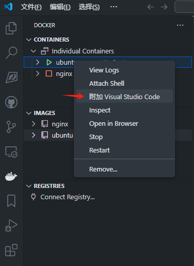

https://docs.docker.com/

# Docker 容器开发

> 创建自己的开发镜像

## 下载 Docker Desktop on Windwos

https://docs.docker.com/desktop/install/windows-install/

## 下载 Docker Desktop on Linux

https://docs.docker.com/desktop/setup/install/linux/

## 将非 root 用户添加到 Docker 用户组

> 可以解决桌面端 docker 无法正常显示的问题

```bash
# 查看是否存在 docker 用户组
grep docker /etc/group
# 若不存在 docker 用户组则创建
sudo groupadd docker
# 将非 root 用户添加到 docker 用户组
sudo usermod -aG docker <用户名>
```

## Ubuntu 镜像使用

### 首次运行

```powershell
# 这里的镜像名字为 ubuntu
docker run --network host -it --name myenv <镜像名称>
# 可以共享 USB 设备的启动方式
docker run -it --privileged --device=/dev/bus/usb --network host --name myenv <镜像名称>
```

> 运行容器时使用 `--network host` 选项，这样容器会直接使用主机的网络，包含 VPN 的配置。
>
> `--privileged` 打开超级用户权限。
>
> `--device=/dev/bus/usb` 挂载 USB 设备。
>
> `-it` 以交互窗口运行容器。
>
> `--name myenv` 设置容器名称为 `myenv`。

### 再次进入

```powershell
# 这里的容器名字为 myenv
docker start <容器ID或名称>
docker exec -it <容器ID或名称> bash
```

### 检查容器是否可以访问外网

```powershell
# 检查生成的 index.html 文件即可
wget www.google.com
```

> 墙会阻止 ping 接受网址发回的响应数据。
>
> curl 不能访问中转网址。

## Docker 命令

> docker <命令> --help

### 镜像操作

#### 检索镜像

> ```
> Usage:  docker search [OPTIONS] TERM
> ```

```bash
docker search <镜像名称>
```

#### 下载镜像

> ```
> Usage:  docker pull [OPTIONS] NAME[:TAG|@DIGEST]
> ```

```bash
docker pull <镜像名称>:[镜像版本]
```

#### 查看本地镜像

> ```
> Usage:  docker images [OPTIONS] [REPOSITORY[:TAG]]
> ```

```bash
docker images
```

#### 删除镜像

> ```
> Usage:  docker rmi [OPTIONS] IMAGE [IMAGE...]
> ```

```bash
docker rmi <镜像ID>
docker rmi <镜像名称>:[镜像版本]
```

#### 提交镜像

> ```
> Usage:  docker commit [OPTIONS] CONTAINER [REPOSITORY[:TAG]]
> ```

```bash
docker commit -m "镜像信息" <容器名称> <镜像名称>:[镜像版本]
```

#### 保存镜像

> ```
> Usage:  docker save [OPTIONS] IMAGE [IMAGE...]
> ```

```bash
docker save -o <打包名称.tar> <镜像名称>:[镜像版本]
```

#### 加载镜像

> ```
> Usage:  docker load [OPTIONS]
> ```

```bash
docker load -i <打包名称.tar>
```

### 容器操作

#### 运行容器

> ```
> Usage:  docker run [OPTIONS] IMAGE [COMMAND] [ARG...]
> ```

```bash
docker run [OPTIONS] IMAGE [COMMAND] [ARG...]
```

|                    | 参数                                  | 说明                                                      | 示例                                                         |
| :----------------- | :------------------------------------ | :-------------------------------------------------------- | :----------------------------------------------------------- |
| 核心参数           | **-d (--detach)**                     | 后台运行容器                                              | **docker run -d nginx**                                      |
| **-it**            | 交互式运行（组合 -i STDIN 和 -t TTY） | **docker run -it ubuntu /bin/bash**                       |                                                              |
| **--name**         | 指定容器名称                          | **docker run --name my_nginx nginx**                      |                                                              |
| **--rm**           | 容器退出后自动删除                    | **docker run --rm alpine echo "hello"**                   |                                                              |
| 设备挂载           | **--device**                          | 挂载设备文件到容器中（默认权限rwm）                       | **docker run --device=<主机设备路径>:<容器内路径>[:权限] ...** |
| 网络相关           | **-p (--publish)**                    | 端口映射（主机:容器）                                     | **docker run -p 8080:80 nginx**                              |
| **--network**      | 指定网络模式                          | **docker run --network=host nginx**                       |                                                              |
| **--add-host**     | 添加自定义主机名解析                  | **docker run --add-host=test:127.0.0.1 alpine**           |                                                              |
| 资源限制           | **-m (--memory)**                     | 内存限制                                                  | **docker run -m 512m alpine**                                |
| **--cpus**         | CPU 核心数限制                        | **docker run --cpus=1.5 nginx**                           |                                                              |
| **--shm-size**     | 共享内存大小                          | **docker run --shm-size=1g redis**                        |                                                              |
| 卷挂载             | **-v (--volume)**                     | 挂载主机目录到容器                                        | **docker run -v /data:/app nginx**                           |
| **--mount**        | 更灵活的挂载方式                      | **docker run --mount type=bind,src=/data,dst=/app nginx** |                                                              |
| 权限与安全         | **--privileged**                      | 赋予容器特权模式                                          | **docker run --privileged ubuntu**                           |
| **-u (--user)**    | 指定运行用户                          | **docker run -u 1000 alpine**                             |                                                              |
| **--cap-add**      | 添加 Linux 能力                       | **docker run --cap-add=SYS_ADMIN alpine**                 |                                                              |
| 环境变量           | **-e (--env)**                        | 设置环境变量                                              | **docker run -e MY_VAR=123 alpine**                          |
| **--env-file**     | 从文件读取环境变量                    | **docker run --env-file=.env nginx**                      |                                                              |
| 其他常用           | **--restart**                         | 重启策略（如 always）                                     | **docker run --restart=always nginx**                        |
| **-w (--workdir)** | 设置容器工作目录                      | **docker run -w /app alpine pwd**                         |                                                              |
| **--entrypoint**   | 覆盖镜像默认入口                      | **docker run --entrypoint=/bin/sh nginx**                 |                                                              |

##### **注意事项**

- 使用 `--privileged` 会降低安全性，仅在需要时使用。
- `-v` 和 `--mount` 区别：后者支持更多选项（如只读挂载）。
- 生产环境建议明确设置资源限制（`-m`, `--cpus`）。

#### 查看容器

> ```
> Usage:  docker ps [OPTIONS]
> ```

```bash
docker ps
```

#### 停止容器

> ```
> Usage:  docker stop [OPTIONS] CONTAINER [CONTAINER...]
> ```

```bash
docker stop
```

#### 启动容器

> ```
> Usage:  docker start [OPTIONS] CONTAINER [CONTAINER...]
> ```

```bash
docker start
```

#### 重启容器

> ```
> Usage:  docker restart [OPTIONS] CONTAINER [CONTAINER...]
> ```

```bash
docker restart
```

#### 查看容器状态

> ```
> Usage:  docker stats [OPTIONS] [CONTAINER...]
> ```

```bash
docker stats
```

#### 查看容器日志

> ```
> Usage:  docker logs [OPTIONS] CONTAINER
> ```

```bash
docker logs
```

#### 进入容器

> ```
> Usage:  docker exec [OPTIONS] CONTAINER COMMAND [ARG...]
> ```

```bash
docker exec
```

|                    | 参数               | 说明                                      | 示例                                                       |
| :----------------- | :----------------- | :---------------------------------------- | :--------------------------------------------------------- |
| 核心参数           | **-it**            | 交互式进入容器（组合 -i 和 -t）           | **docker exec -it nginx bash**                             |
| **-u (--user)**    | 指定执行命令的用户 | **docker exec -u root nginx whoami**      |                                                            |
| **-w (--workdir)** | 设置命令的工作目录 | **docker exec -w /app nginx pwd**         |                                                            |
| 后台执行           | **-d (--detach)**  | 后台运行命令（不占用终端）                | **docker exec -d nginx tail -f /var/log/nginx/access.log** |
| 环境变量           | **-e (--env)**     | 设置临时环境变量                          | **docker exec -e DEBUG=1 nginx env**                       |
| **--env-file**     | 从文件读取环境变量 | **docker exec --env-file=.env nginx env** |                                                            |
| 权限控制           | **--privileged**   | 赋予命令特权权限                          | **docker exec --privileged nginx ip addr**                 |

##### **注意事项**

- **容器必须处于运行状态**（先通过 `docker ps` 确认）。
- 命令中涉及特殊字符（如 `$`）需用引号或转义（如 `sh -c`）。
- 生产环境中谨慎使用 `--privileged`。

#### 删除容器

> ```
> Usage:  docker rm [OPTIONS] CONTAINER [CONTAINER...]
> ```

```bash
docker rm <容器名称>
```

#### 挂载目录

```bash
# 后台启动容器挂载本地目录
docker run -d -v <本地目录>:<容器目录> --name <容器名称> <镜像名称>
```

#### 卷映射

> 卷名不已 `.` 和 `/` 位置符号开头
>
> 卷映射本地文件位置在 `/var/lib/docker/volumes`

```bash
# 自动创建卷
docker run -d -v <卷名>:<容器目录> --name <容器名称> <镜像名称>
# 主动创建卷
docker volume creat <卷名>
# 查看卷
docker volume ls
# 查看卷详情
docker volume inspect <卷名>
```

### Docker-compose

> 调用 Dockerfile 构建镜像，并管理多个容器的生命周期。

| **命令**                   | **作用**                      |
| -------------------------- | ----------------------------- |
| `docker`` ``compose up`    | 启动所有服务（`-d` 后台运行） |
| `docker`` ``compose down`  | 停止并删除所有容器            |
| `docker`` ``compose build` | 重新构建镜像                  |
| `docker`` ``compose logs`  | 查看日志（`-f` 实时跟踪）     |
| `docker`` ``compose ps`    | 查看运行中的容器              |

### **Dockerfile** 

> 定义单个容器的构建规则。
>
> Usage:  docker buildx build [OPTIONS] PATH | URL | -

```txt
# -t：指定镜像名称和标签
# . ：Dockerfile 所在目录
docker build -t my-image:latest .
```

## Docker Compose 语法

> Docker Compose 使用 **YAML** 格式（通常是 `docker-compose.yml` 文件）来定义和编排多容器应用。
>
> **`services`**：定义容器（镜像、端口、卷、网络等）。
>
> **`volumes`**：管理持久化存储。
>
> **`networks`**：控制容器间通信。
>
> **`devices`**：挂载硬件设备（嵌入式开发关键）。

###  **基本结构**

```yaml
version: "3.8"  # 指定 Compose 文件版本（推荐 3.8+）
services:       # 定义所有服务（容器）
  service1:     # 服务名称（自定义）
    image: nginx  # 使用现成的镜像
    ports:
      - "80:80"
  service2:
    build: .     # 使用 Dockerfile 构建镜像
    volumes:
      - ./data:/app/data
volumes:        # 定义数据卷（持久化存储）
  my-volume:
networks:       # 定义网络
  my-network:
```

### 核心配置项

| 字段          | 作用                      | 示例                                                         |
| :------------ | :------------------------ | :----------------------------------------------------------- |
| `image`       | 指定镜像名称              | `image: nginx:alpine`                                        |
| `build`       | 基于 Dockerfile 构建镜像  | `build: ./dir` 或 `build: context: ./dir dockerfile: Dockerfile.dev` |
| `ports`       | 端口映射（`宿主机:容器`） | `ports: - "8080:80"`                                         |
| `volumes`     | 挂载宿主机目录或卷到容器  | `volumes: - ./app:/app`                                      |
| `environment` | 设置环境变量              | `environment: - DB_HOST=db`                                  |
| `env_file`    | 从文件加载环境变量        | `env_file: .env`                                             |
| `depends_on`  | 定义服务依赖顺序          | `depends_on: - db`                                           |
| `restart`     | 容器退出时重启策略        | `restart: always`                                            |
| `networks`    | 加入自定义网络            | `networks: - my-network`                                     |
| `devices`     | 挂载宿主机设备（如串口）  | `devices: - "/dev/ttyUSB0:/dev/ttyUSB0"`                     |

### volumes**（数据卷）**

用于持久化存储：

```yaml
volumes:
  db-data:  # 自定义卷名（由 Docker 管理）
  app-data:
    driver: local  # 使用本地驱动
```

**挂载示例**：

```yaml
services:
  db:
    image: postgres
    volumes:
      - db-data:/var/lib/postgresql/data  # 使用命名卷
      - ./config:/etc/postgresql         # 挂载主机目录
```

### networks**（网络）**

自定义容器间通信网络：

```yaml
networks:
  my-network:
    driver: bridge  # 默认驱动
    ipam:
      config:
        - subnet: "172.20.0.0/24"  # 指定子网
```

**服务中使用**：

```yaml
services:
  web:
    networks:
      - my-network
  db:
    networks:
      - my-network
```

### **常用示例**

#### 多服务协作（Web + Redis）

```yaml
version: "3.8"
services:
  web:
    build: .
    ports:
      - "5000:5000"
    depends_on:
      - redis
  redis:
    image: redis:alpine
```

#### 挂载设备和环境变量

```yaml
version: "3.8"
services:
  embedded-app:
    build: .
    devices:
      - "/dev/ttyUSB0:/dev/ttyUSB0"  # 挂载串口
    environment:
      - SERIAL_PORT=/dev/ttyUSB0
    volumes:
      - ./firmware:/app/firmware  # 挂载代码目录
```

#### **自定义网络和数据卷**

```yaml
version: "3.8"
services:
  db:
    image: mysql
    volumes:
      - db-data:/var/lib/mysql
    networks:
      - backend
  api:
    build: ./api
    networks:
      - backend
      - frontend
volumes:
  db-data:
networks:
  backend:
  frontend:
```

## Dockerfile 语法

> **Dockerfile** 是构建镜像的“配方”，专注于单个容器的环境定义。
>
> **与 Compose 协作**：Dockerfile 构建镜像，Compose 管理运行时。
>
> Dockerfile 是一个文本文件，包含一系列指令，用于定义如何构建 Docker 镜像。它描述了镜像的基础环境、依赖安装、文件复制、启动命令等。

### **基本结构**

```dockerfile
# 注释行（以 # 开头）
FROM base-image:tag      # 指定基础镜像（必须）
RUN command              # 执行命令（安装软件、配置环境）
COPY src dest            # 复制文件/目录到镜像
WORKDIR /path            # 设置工作目录
EXPOSE port              # 声明容器运行时监听的端口
CMD ["executable", "arg1", "arg2"]  # 容器启动时运行的默认命令
```

### **核心指令**

| **指令**     | **作用**                                                     | **示例**                                           |
| :----------- | :----------------------------------------------------------- | :------------------------------------------------- |
| `FROM`       | 指定基础镜像（必须第一个指令）                               | `FROM ubuntu:20.04`                                |
| `RUN`        | 执行命令（安装软件、配置环境）                               | `RUN apt-get update && apt-get install -y python3` |
| `COPY`       | 复制本地文件到镜像（推荐）                                   | `COPY ./app /app`                                  |
| `ADD`        | 类似 `COPY`，但支持自动解压和远程 URL（慎用）                | `ADD https://example.com/file.tar.gz /tmp`         |
| `WORKDIR`    | 设置工作目录（后续指令的默认路径）                           | `WORKDIR /app`                                     |
| `ENV`        | 设置环境变量                                                 | `ENV PYTHONPATH=/app`                              |
| `ARG`        | 定义构建时的变量（`docker build --build-arg` 传入）          | `ARG USER=admin`                                   |
| `EXPOSE`     | 声明容器运行时监听的端口（实际映射需在 `docker run` 或 Compose 中指定） | `EXPOSE 80`                                        |
| `CMD`        | 容器启动时的默认命令（可被 `docker run` 覆盖）               | `CMD ["python", "app.py"]`                         |
| `ENTRYPOINT` | 类似 `CMD`，但不可被覆盖（通常与 `CMD` 结合使用）            | `ENTRYPOINT ["python"]` + `CMD ["app.py"]`         |
| `VOLUME`     | 声明数据卷挂载点（实际挂载需在 `docker run` 或 Compose 中指定） | `VOLUME /data`                                     |
| `USER`       | 指定运行命令的用户（避免 root 权限）                         | `USER nobody`                                      |
| `LABEL`      | 添加元数据（如作者、版本）                                   | `LABEL maintainer="your@email.com"`                |

### **完整示例**

#### **示例 1：Python 应用**

```dockerfile
# 基于 Python 官方镜像
FROM python:3.9-slim

# 设置工作目录
WORKDIR /app

# 复制依赖文件并安装
COPY requirements.txt .
RUN pip install --no-cache-dir -r requirements.txt

# 复制应用代码
COPY . .

# 声明环境变量
ENV FLASK_APP=app.py

# 暴露端口（Flask 默认 5000）
EXPOSE 5000

# 启动命令
CMD ["flask", "run", "--host=0.0.0.0"]
```

#### **示例 2：嵌入式开发（交叉编译环境）**

```dockerfile
# 使用 ARM 交叉编译工具链镜像
FROM arm-none-eabi-gcc:latest

# 安装额外工具
RUN apt-get update && apt-get install -y \
    minicom \
    screen \
    && rm -rf /var/lib/apt/lists/*

# 设置串口访问权限（Linux dialout 组）
RUN usermod -aG dialout developer

# 复制项目代码
COPY ./firmware /firmware
WORKDIR /firmware

# 默认编译命令
CMD ["make", "all"]
```

## Docker 配合 VSCode

### 在 VSCode 中安装 Docker 插件


### 使用 VSCode 打开容器



> 附加 Visual Studio Code 后会自动打开一个在该容器中的窗口。

## 安装嵌入式相关依赖

> 默认情况下进入容器时用户为 root 不需要使用 sudo。

### 系统和软件包更新

```bash
apt update && apt upgrade -y
```

### 软件下载

- cmake

```bash
apt install cmake -y
```

- python

```bash
apt install python3 -y
```

- DTC

```bash
apt install device-tree-compiler -y
```

- usbutils  

```powershell
apt install usbutils -y
```

- `wget`
- `sudo`

## 镜像提交保存

### 镜像提交

```powershell
# docker commit -m <提交信息> <容器ID或名称> <导出的镜像名>:<TAG>
docker commit -m "commit info" myenv myenv:v1.0
```

### 镜像打包

```powershell
docker save -o myenv.tar myenv:v1.0
```

### 镜像加载

```powershell
docker load -i myenv.tar
```

## 目录挂载

> 挂载主机的文件系统到 docker 容器。
>
> docker run -v /外部目录/内部目录

```powershell

```

## 卷映射

> 同步主机与容器的文件。
>
> docker run -v 卷名/内部目录

### 创建卷

```powershell
docker volume create <卷名>
```

### 查看卷的信息

```powershell
docker volume inspect <卷名>
```

# Help

## 共享 USB 设备

### 镜像启动参数

```powershell
docker run -it --privileged --device=/dev/bus/usb --network host --name myenv <镜像名称>
```

### 镜像挂载 USB

[WSL](https://z1eac6eifxs.feishu.cn/wiki/HEygwDADvi9H2vkZqYCcLKQonKe#share-DLgddS5fkoq3a8x0O1lcaYeAnFh)

> 镜像挂载 USB 的方式与 WSL 相同。

## 共用主机 SSH 密钥

> 主机需已经存在 SSH 密钥对

https://geek-docs.com/git/git-questions/203_git_how_to_pass_local_machines_ssh_key_to_docker_container.html