# **Zigbee 基础知识**

## **Zigbee 简要介绍**

Zigbee 在 2.4G 频段下最大传输速率为 250kbps。

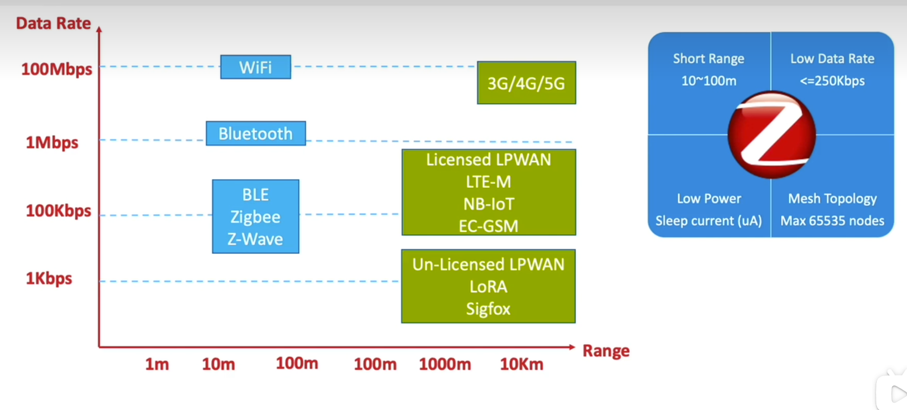

## **Zigbee 协议栈的分层架构图**

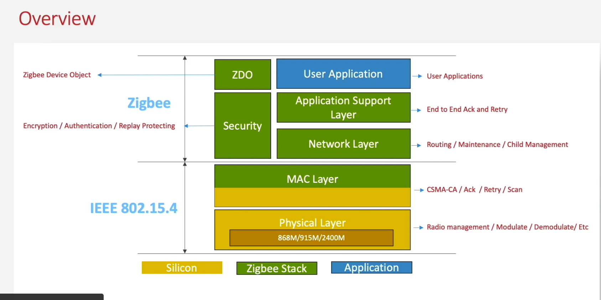

1. Silicon 硬件层

   1. Physical Layer 物理层
   2. MAC Layer 介质访问控制层

2. Zigbee Stack 协议栈层，基于 IEEE 802.15.4（低功耗无线个域网标准）构建

   1. Security 安全层

      1. Network Layer 网络层
      2. APS(Application Support Layer) 应用支持子层，负责端到端的重传和确认

   2. ZDO(Zigbee Device Object) 设备对象

      驻留在应用层、通过端点 0（Endpoint 0）工作，负责网络与设备的初始化、发现、绑定、安全与远程管理。

   3. User Application 应用层

### **Physical Layer**

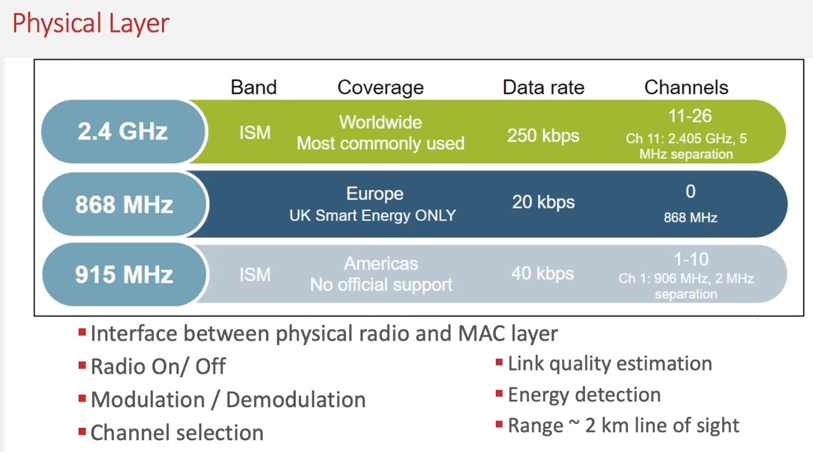

### **MAC Layer 介质访问控制层**

Frame Control 可以指定四种类型的数据帧，Beacon、Data、Ack 和 CLI。

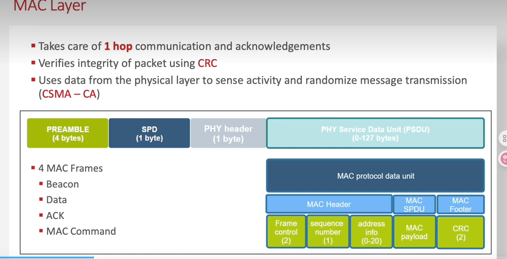

1. Hop-by-Hop Ack 

   在 MAC 层是逐跳的确认，在 APS 层是端到端的确认。

   

2. CRC 校验包的完整性。

3. CSMA/CA 信道竞争，防冲突。

## **Zigbee 网络架构**

Zigbee 网络支持 Star、Mesh 和  Hybrid Mesh结构

### **Star Netwok 星状网络**

在星型网络架构中，中央枢纽节点是所有通信的中枢。该节点可能因网络/处理带宽受限而成为瓶颈。这种拓扑结构与网状网络差异显著，其传输能力受限于枢纽节点的通信半径。

### **Full Mesh Network** 全连接网状网络

 在全网状网络中，所有节点均为路由器节点，包括协调器在完成网络构建后。由于所有节点均可为其他节点提供信息中继，这种拓扑结构对链路故障的抵抗力最强；几乎不可能出现某个设备成为整个网络单点故障的情况。

### **Hybrid Mesh Network** 混合网状网络

混合型网状网络拓扑结构融合了星型与网状两种架构的优势。相较于星型拓扑，混合网络能实现更远距离的通信；相较于网状拓扑，它更支持分层设计。该拓扑结构由 EmberZNet PRO 协议栈构建，通过路由器设备作为星型子网的中心节点，每个中心节点均可连接终端设备。

##  **设备类型**

Zigbee 规范支持单个网络中最多配置一个协调器、多个路由器及多个终端设备。

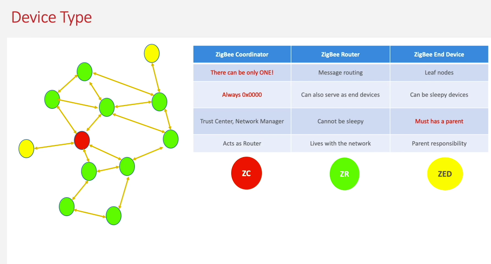

### **Zigbee Coordinator （ZC）协调器**

负责构建集中式网络。这种路由器具备额外功能，其固有网络地址为 0x0000（Short ID）。协调器的主要功能包括：在扫描可用频道后选择合适频道，以及选择 Extend PAN ID 网络建立完成后，协调器将作为路由器运行。从安全角度出发，只有协调器才能被指定为网络启动时的集中信任中心。

### **Zigbee Router （ZR）路由器**

负责为网络设备提供路由服务。路由器也可作为终端设备使用。与终端设备不同，路由器设计为不休眠模式，当网络连接建立，应保持开启状态。

### **Zigbee End Device （ZED）终端设备**

 它们仅通过父节点进行通信，且与路由器设备不同，无法转发发往其他节点的消息。根据网络协议栈的不同，终端设备可分为多种类型：

1. Sleepy End Device 休眠终端设备

   在空闲时会关闭无线模块以节省资源。但需定期轮询父节点接收消息和确认信息，且只有在终端主动请求时才会发送数据。

2. Non-sleepy End Device 非休眠终端设备

不进入低功耗休眠模式、持续保持通信就绪状态的终端节点。

## **Zigbee 路由概念**

Zigbee协议中根据网络结构和预期流量模式提供了多种路由机制。

### **Table Routing 表路由**

路由的形成始于某个节点发起寻路请求，发现通往其他节点的路径。当两个节点间建立路由后，源节点会按照其路由表中的指定顺序，将消息发送给路径上的第一个节点。沿途的每个中间节点都会根据自身路由表，将消息转发给下一个节点（即"hop"），直到消息抵达目的地。若路由建立失败，系统会向消息发起方返回路由错误信息，以便其重新规划路径。

### **Broadcast Routing 广播路由**

广播路由是一种向网络中所有设备发送消息的机制。网络层面的广播选项支持三种模式：仅向路由器发送、向所有非休眠节点（包括终端设备）发送，或同时向休眠终端设备发送。广播消息会由网络中所有具备路由功能的设备重复传输三次，确保消息送达所有设备。虽然广播是可靠的消息传输方式，但由于对网络性能的影响，应谨慎使用。重复广播可能会限制网络中其他正在进行的流量。此外，广播并非向休眠设备发送消息的可靠方式，因为父设备需要为休眠子设备缓冲消息，但可能在终端设备唤醒前就丢弃了消息。

### **Multicast Routing 组拨路由**

组播路由提供了一对多的路由选择方案。当单个设备需要向多个设备发送消息时，就会使用组播技术。通过这种机制，所有设备都会加入组播组，只有组内成员才能接收消息，其他设备则负责转发这些组播信息。组播本质上是一种经过筛选的有限广播，应当仅在必要时使用，因为过度使用广播机制可能降低网络性能。需要特别注意的是，组播消息不会进行确认。

### **Many-to-One/Source Routing 多对一/源路由**

集中器主动发送单一路由发现请求，在所有路由器中统一建立 “指向集中器” 的路由条目，替代各设备单独发起的一对一路由请求，简化路由建立流程。解决常规表路由的内存痛点 —— 避免网络中所有设备（尤其是低内存终端）存储庞大路由表，仅需让所有设备通过单条 “下一跳路径” 连接至中心 “集中器”（如协调器），各设备仅需 1 条路由表项。

### **Zigbee Cluster Library 集群库**

在 Zigbee 集群库（ZCL）中，集群是一组用于通过 Zigbee 网络发送和接收相关命令和数据的消息。

### **Inside Clisters** 内置功能簇

#### **Clinets and Servers 客户端和服务器**

 每个集群都分为客户端和服务器端两个部分。集群的客户端会向服务器端发送消息，也可能接收来自服务器端的消息。与 HTTP 协议不同的是这里的客户端并不是绝对的。

Server cluster：是提供功能 / 数据的一方。

Client cluster：是发起操作的一方。

由于所有命令都包含发送方和接收方，每个集群都由两部分构成——服务器端和客户端，如下图所示。支持集群服务器端的设备将与支持同一集群客户端端的设备进行通信。

#### **Attributes 属性**

属性是与集群端点相关联的数据，集群的服务器端和客户端各自可能拥有多个属性。

每个属性包含以下要素：16位标识符、数据类型、只读/可读标识符、默认值以及是否强制支持的选项。

#### **Commands 命令**

 命令由8位命令标识符和有效载荷格式组成。与属性一样，8位标识符仅在特定集群端内唯一。

命令分为两种类型：

1. Global Commands 全局命令

   全局命令在 ZCL 规范中定义，不特定于任何集群。这些全局命令最初被称为全配置文件命令。

   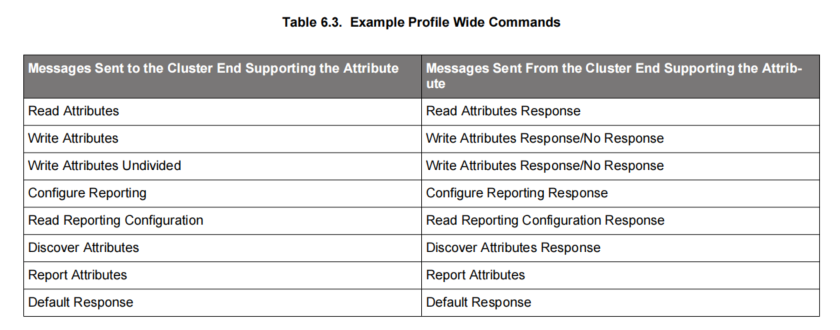

2. Cluster-Specific Commands 集群专用命令

负载格式、支持要求（强制/可选）以及接收集群特定命令时的行为，均在集群定义中予以明确。通常命令会影响接收设备的状态，并可以作为副作用改变集群的属性。

### **Zigbee 3.0**

该标准将所有应用配置文件整合为统一的应用层，同时为产品认证引入更全面的测试覆盖，确保 Zigbee 设备在实际应用中具备更强的互操作性。

#### The Base Device Behavior Specification (BDB)

## **相关基础术语**

### **Beacon 定时广播信号**

是由协调器（Coordinator）或路由器（Router） 周期性发送的广播帧，核心作用是宣告网络存在、同步节点时钟、传递网络关键参数。

### **Announce 通告报文**

在设备入网后，通告自身状态和关键信息。

1. Full Function Device 全功能设备
   1. Coordinator
   2. Router
2. Reducde Function Device 受限功能设备
   1. End Device
   2. Sleepy End Device

### **Network Address** 网络标识

 一个网络有且仅有一个协调器

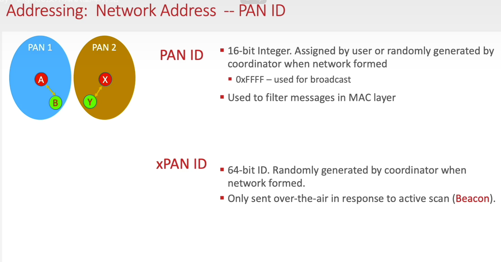

1. PAN(Personal Area Network) ID -- PID 有效数据占比高，网络短标识 2 字节，本地唯一，设备本地区分网络。协调器随机生成或者手动配置。
2. xPAN ID（Extend PAN ID）-- EPID 网络长标识符 8 字节，全球唯一。可以精确识别目标网络，避免短标识冲突。由协调器生成（通常基于自身 IEEE 地址）

### **Node ID and IEEE Address 设备标识**

1. Short ID / Node ID 节点 ID 2 字节，仅网络内唯一，入网时由协调器或父路由器动态分配，设备内快速通讯，离网失效。
2. LongID / IEEE address 物理地址也叫 MAC 地址 8 字节，全球唯一，出厂时固化，设备身份认证入网时唯一识别，与设备绑定不会失效。

### **Stochastic Assignment 短地址随机分配**

随机分配（主要是 PAN ID，也包括部分场景下的 Short ID），协调器为避免网络标识冲突，简化网络部署，通过随机算法生成未被占用的标识。

1. **协调器**启动后，先扫描周围环境中（其他协调器创建的网络）的 Zigbee 网络，收集已被使用的 PAN ID（避免重复）。
2. 协调器通过随机算法，从 PAN ID 的有效范围（0x0001~0xFFFE，排除 0x0000 广播地址和 0xFFFF 无效地址）中，随机选取一个 “未被占用” 的 PAN ID。
3. 若随机选中的 PAN ID 已被周边网络使用，则重新随机生成，直到找到唯一可用的 PAN ID。
4. 确认 PAN ID 可用后，协调器将其作为当前网络的 “本地短标识”，并同步生成全球唯一的 XPAN ID（通常基于自身 IEEE 地址，非随机）。

**Endpoint 逻辑端口**

逻辑端口在同一物理设备上隔离多个独立应用功能，类似于 TCP/IP 中的端口号。

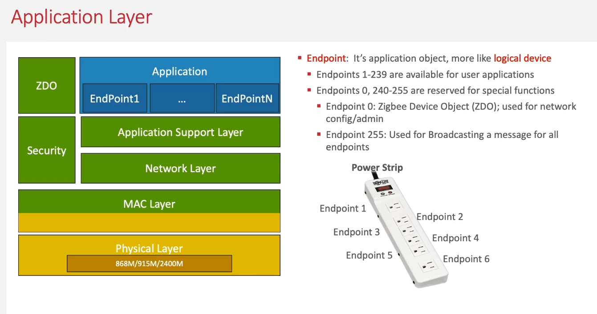

1. 逻辑隔离：一个物理设备（如智能网关）可通过多个 Endpoint 同时运行不同功能（如温湿度采集、灯光控制、窗帘电机），各功能独立管理与通信。
2. 通信定位：数据包需同时指定目标设备短地址 + 目标 Endpoint，确保数据准确送达对应应用模块；无匹配 Endpoint 时数据包会被丢弃。
3. 功能封装：每个 Endpoint 绑定特定 Cluster（功能簇）与 Attribute（属性），定义其支持的服务（如开关、亮度调节、传感器数据上报）。
4. 端口号规则如下

| **编号**    | **用途**                    | **说明**                                               |
| ----------- | --------------------------- | ------------------------------------------------------ |
| **0**       | ZDO（Zigbee Device Object） | 设备配置与管理入口，负责网络发现、绑定、安全等底层操作 |
| **1–240**   | 用户自定义应用              | 可分配给传感器、开关、照明等具体功能，最多 240 个      |
| **241–254** | 协议保留                    | 供 Zigbee 规范扩展使用，用户不可占用                   |
| **255**     | 广播端点                    | 向设备所有应用端点广播数据，用于全局通知               |

### **Cluster 簇**

簇是标准化功能模块，不同厂商不同设备间的标准化接口，类似于 HTTP 协议。

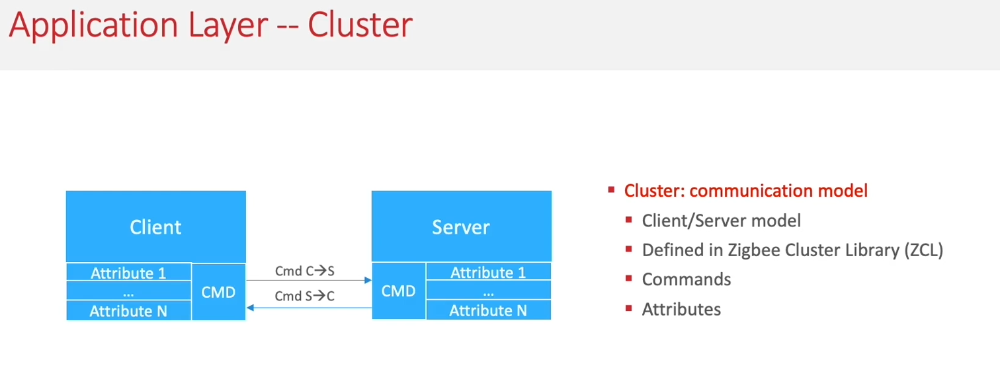

1. Cluster ID 2 字节，Zigbee 联盟定义 0x0000–0x7FFF 为通用功能，0x8000–0xFFFF 提供给厂商自定义。
2.  每个 Cluster 都需要指定数据流向，如 Input、Output 和 Input/Output。
3. 1 个 Endpoint 可以绑定多个 Cluster，一个逻辑功能 Endpoint 可以包含多个子功能，需要通过多个 Cluster 去实现。

### **Zigbee Security Suite（ZSS）**

ZSS 是由 IEEE 802.15.4 定义的底层安全基础，提供 AES‑128 加密、CCM* 认证与完整性保护等核心能力，被 MAC、NWK、APS 层共享。

#### **Message Integrity Check 消息完整性校验，防止数据被篡改。**

 发送方和接收方使用相同的会话密钥对数据帧进行加密和解密（CMAC 计算）。 

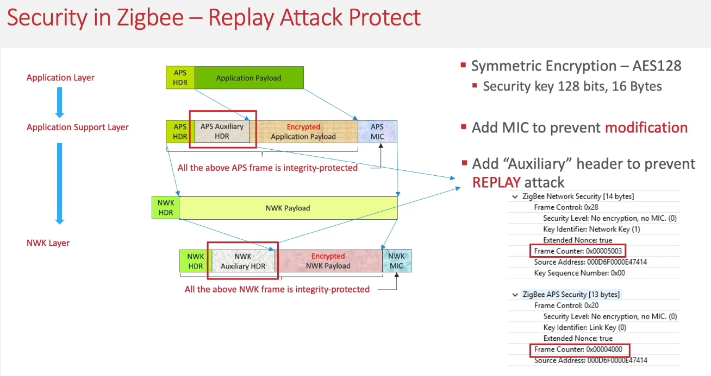

##### **Link Key**

应用层：用 Link Key（设备间 pairwise 密钥）保护点对点消息。

1. Pre-configured Link Key（预配置密钥）：出厂前写入设备（如信任中心的全球唯一密钥 ZigbeeAlliance09）。
2. Derived Link Key（派生密钥）：设备入网后，通过信任中心（协调器）基于 NWK Key 动态协商生成。
3. User-defined Link Key（用户自定义密钥）：通过上位机 / APP 手动配置（如工业场景的专属密钥）。

##### **NWK(network) Key**

网络层：用 Network Key（网络密钥）保护广播 / 组播消息。

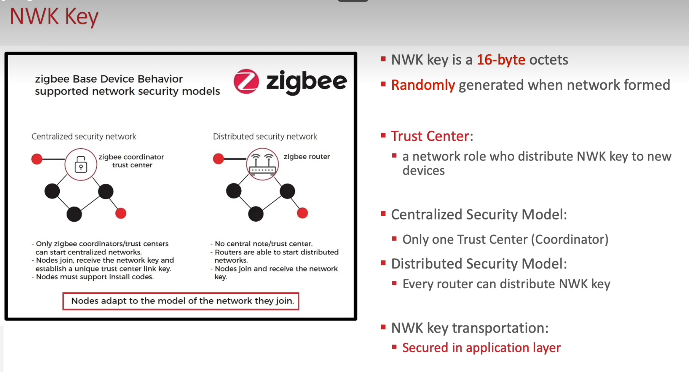

1.  网络创建时由协调器（信任中心）生成。
2.  新设备入网时，由协调器通过 “安全信令” 加密分发（用 Pre-configured Link Key 或设备自带的 Master Key 加密传输）。
3.  网络密钥更新（Key Refresh）时，协调器统一分发新密钥。

#### **Replay Attack Protect 重放攻击防护**

Fram Countor 帧计数器 32 位，每个设备独立的维护发送帧和接收帧计数器，拒绝接收计数器不合法的消息，防止数据伪造或重复利用。

#### **Hop-By-Hop vs End-to-End**

1. Hop-By-Hop 是网络层（NWK）采用的逐跳安全策略，依赖 NWK Key 实现每跳解密、验证与重加密，保障路由与广播安全。
2. End-to-End 是应用支持子层（APS）采用的端到端安全策略，依赖 Link Key 实现源与目的设备的直接加密 / 解密，保护应用层隐私数据。

#### **Install Code 设备身份认证凭证**

 主要作用是替代传统预配置 Link Key（如 ZigbeeAlliance09）

#### **Trust Center 安全核心与管控中枢**

所有设备入网、密钥分发、安全策略变更都必须经过其认证与授权，确保只有合法设备接入网络，且数据传输符合安全规则。

#### **Use Well-know Link Key**

在建立连接时协调器通过 Well-know Link Key 作为密钥将加密后的 NWK Key 发送给基础设备。

#### **Use Install Code**

在建立连接时协调器通过手动获取到的 Install Key 作为密钥将加密后的 NWK Key 发送给基础设备。

## **参考文档**

<embed src="/viys/docs/ug103-02-fundamentals-zigbee.pdf" type="application/pdf" width="100%" height="600px">
