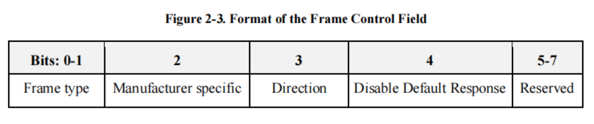

# **ZCL**

为解决 Zigbee 设备开发中功能复用与互操作问题，通过定义涵盖基础架构（如帧结构、数据类型、全局命令）及通用、测量与传感、照明、HVAC 等多领域的集群规范，为开发者提供可复用的集群功能库以减少重复开发，确保不同 Zigbee 设备基于统一标准实现互操作，推动 Zigbee 技术在智能家居、工业控制等场景的标准化应用。

## **Introduction**

主要是一些概念的介绍。

ZCL由ZCL基础部分、一组适用于整个库的元素（如帧结构、属性访问命令和数据类型）以及多个集群集组成。

### Definitions

此处定义直译 ZCL 文档，此处定义是根据自己理解编写的[[2_ZigBee_BDB]]

| **定义名称**          | **中文名称**    | **定义解释**                                                 |
| --------------------- | --------------- | ------------------------------------------------------------ |
| Application Cluster   | 应用集群        | 生成客户端与服务器之间持久化功能性应用事务的集群。           |
| Attribute             | 属性            | 表示物理量或状态的数据实体，其数据通过命令与其他设备通信。   |
| Binding               | 绑定            | 本地集群实例与一个或多个对应远程集群实例的持久化映射，支持广播、组播或单播；单播绑定包含地址（IEEE 或网络地址）和端点。 |
| Cluster               | 集群            | 定义一个或多个属性、命令、行为及依赖关系的规范，支持独立的实用程序或应用功能； |
| Cluster identifier    | 集群标识符      | 16 位数字，映射到（标识）单个集群规范；多个集群标识符可映射到同一集群规范，每个标识符定义不同的范围和用途；集群标识符在简单描述符中被指定为 “输入” 或 “输出”，用于创建绑定表。 |
| Client                | 客户端          | 在端点的简单描述符 “输出集群列表” 中列出的集群接口；通常发送命令以操作对应服务器集群上的属性；客户端集群与具有相同集群标识符的对应远程服务器集群通信。 |
| Corresponding Cluster | 对应集群        | 集群的对立端（客户端对应服务器，服务器对应客户端）。         |
| Device                | 设备            | 定义唯一设备标识符及端点上需实现的一组必选和可选集群的规范；该术语也可指端点上该设备规范的实现或实例。 |
| Node                  | 节点            | 在单个 Zigbee 协议栈上运行的 Zigbee 应用的可测试实现，具有单个网络地址，属于单个网络。 |
| Product               | 产品            | 拟用于市场销售的节点。                                       |
| Server                | 服务器          | 在端点的简单描述符 “输入集群列表” 中列出的集群接口；通常支持集群的全部或大部分属性；服务器集群与具有相同集群标识符的对应远程客户端集群通信。 |
| Service Discovery     | 服务发现        | 设备定位目标服务的能力。                                     |
| Sleepy End Device     | 休眠终端设备    | *rxOnWhenIdle* 设置为 FALSE 的 Zigbee 终端设备。             |
| Utility Cluster       | 实用集群        | 不属于产品应用功能的集群，可用于调试、配置、发现、寻址、诊断等场景。 |
| Type 1 Cluster        | 1 类集群        | 主要功能是从客户端向服务器发起事务的集群。                   |
| Type 2 Cluster        | 2 类集群        | 主要功能是从服务器向客户端发起事务的集群。                   |
| Zigbee End Device     | Zigbee 终端设备 | 参与 Zigbee 网络的 IEEE 802.15.4-2003 RFD（简化功能设备）或 FFD（全功能设备），既非 Zigbee 协调器也非 Zigbee 路由器。 |
| Zigbee Coordinator    | Zigbee 协调器   | IEEE 802.15.4-2003 PAN（个人区域网络）协调器。               |
| Zigbee Router         | Zigbee 路由器   | 参与 Zigbee 网络的 IEEE 802.15.4-2003 FFD，非 Zigbee 协调器，但可在其个人操作空间内作为 IEEE 802.15.4-2003 协调器，能够在设备间路由消息并支持关联操作。 |

#### **Cluster 相关定义对比**

ZCL 中定义部分相较 BDB 文档多出了一些关于 Cluster 的定义，此处对这些 Cluster 进行解释和区分。

目前已经出现的 Cluster 有：Cluster、Application Cluster、Initiator cluster、Target cluster、Utility cluster、Corresponding Cluster、Type 1 Cluster 和 Type 2 Cluster。

| **对比维度**   | **Cluster（集群）**                                          | **Application Cluster（应用集群）**                          |
| -------------- | ------------------------------------------------------------ | ------------------------------------------------------------ |
| **定义与范围** | 广义概念，是 ZCL 中所有功能单元的统称，包含所有类型的集群（应用集群、实用集群等）。 | 狭义概念，是 Cluster 的子集，仅指支撑实际业务场景、产生持久化交互的集群。 |
| **功能核心**   | 聚焦**基础功能封装**，定义某一项独立功能的属性、命令及规则，不绑定具体业务场景。 | 聚焦**业务逻辑实现**，在基础功能之上，支撑设备间长期、稳定的业务交互（如控制、监测、反馈）。 |
| **包含关系**   | 包含 Application Cluster + Utility Cluster（实用集群）等细分类型。 | 是 Cluster 的核心组成部分，也是 ZCL 面向实际应用开发的核心内容。 |
| **使用场景**   | 涵盖所有功能场景，包括基础工具类功能（如调试、配置）。       | 仅覆盖实际业务场景，如智能家居（照明、HVAC）、工业监测（温湿度采集）等。 |
| **典型示例**   | Utility Cluster（实用集群）Application Cluster（应用集群）   | 仅包含业务相关集群，如：Level Control Cluster（0x0008，亮度控制）Occupancy Sensing Cluster（0x0406，人体感应）。 |

| **分类维度** | **包含 / 关联关系**                                          |
| ------------ | ------------------------------------------------------------ |
| **功能用途** | Cluster（整体）= Application Cluster（业务功能） + Utility Cluster（工具功能） + 其他细分集群 |
| **交互角色** | Corresponding Cluster 是 Cluster 的对立端（Client ↔ Server），非包含关系。 |
| **事务方向** | Cluster 按发起方向分为 Type 1（Client→Server）和 Type 2（Server→Client）。 |
| **交互对象** | Initiator Cluster（发起方）与 Target Cluster（目标方）是 Cluster 交互中的双方角色。 |

### Conformance Levels 一致性等级

是定义硬件/软件实现要求的核心规则，用于明确哪些功能是 “必须实现”、“可选实现” 或 “推荐实现”，确保不同厂商的 Zigbee 设备能互操作。

| **一致性等级** | **核心含义**           | **实现义务**                       | **应用场景**                                     |
| -------------- | ---------------------- | ---------------------------------- | ------------------------------------------------ |
| Expected       | 规范默认的设计模型假设 | 无义务（可偏离）                   | 描述硬件 / 软件实现方式、时序逻辑等默认参考      |
| Shall          | 必须实现               | 强制（不实现则不符合规范）         | 核心功能（如集群的 mandatory 属性、全局命令）    |
| Should         | 推荐实现               | 柔性（优先推荐方案，可选等效方案） | 非核心但利于互操作的功能（如推荐的编码格式）     |
| May            | 可选实现               | 完全可选（不实现不影响基础功能）   | 厂商差异化功能（如历史数据存储、自定义报警阈值） |

### Conventions 约定

统一了文档中枚举值、保留字段、数值格式的书写与解析规则，避免歧义，确保不同开发者、厂商对规范内容的解读一致。

#### **Enumerations and Reserved Values（枚举与保留值）**

枚举、字段或标识符的每个未定义值或值范围均应视为为本标准未来修订版预留，不得用于实现。

#### **Reserved Bit Fields（保留位字段）**

任何位长的每个完整或部分数据字段（例如消息数据字段），若未定义，则应视为为本标准的未来修订版预留，且不得用于实现。

#### **Number Format（数值格式）**

明确文档中不同进制数值的表示规则，避免数值解读错误。

## **Foundation 基础**

这一部分比较多。

### **Cluster Library Overview 集群库概述**

ZCL 帧结构与 ZCL 通用命令一同被规定，这些通用命令用于操作 ZCL 中所有已定义集群的属性。此外，还定义了一组可用于表示属性的数据类型，以及 ZCL 中命令返回的一组通用状态值。

#### **Architecture and Data Model 架构与数据模型**

每个集群规范都定义了一个独立的功能实体。每个集群规范对于其目的和范围之外的功能都不了解。应用集群不应依赖其应用领域之外的内容。实用集群可以为其他层提供接口。

一个集群标识符应映射到一个单一的集群规范。集群标识符还定义了集群实例的用途。多个集群标识符（每个都有独特的用途）可以映射到一个更抽象的集群规范。

| **模型类别**                         | **核心定义**                                                 |
| ------------------------------------ | ------------------------------------------------------------ |
| Extensibility Model 可扩展性模型     | 定义集群规范的衍生逻辑，支持在基础集群（Base Cluster）基础上扩展特定功能，同时保持兼容性。 |
| Instance Model 实例模型              | 定义同一设备端点上基础集群与衍生集群的实例关联关系，确保兼容性与一致性。 |
| Conformance Model 一致性模型         | 定义集群功能的实现要求等级，明确必选（M）、可选（O）、废弃（D）的行为规范，确保设备兼容性。 |
| Client/Server Model 客户端服务器模型 | 定义 ZCL 中设备间的交互角色与数据流向，明确客户端（发起请求）与服务器（提供服务）的职责分工，是集群通信的核心交互框架。 |

### **Functional Description 功能描述**

#### **Transmission 传输**

All sub-fields of ZCL frames, including individual bits, that are unspecified, or specified as reserved, SHALL be set to zero for transmission. This applies to all ZCL frames, including cluster-specific frames. Similarly, all reserved or unspecified bits of attributes of data type class Bitmap SHALL be set to zero for transmission.

ZCL 帧的所有子字段（包括各个位）中，未指定或指定为保留的部分，在传输时都必须设置为零。这适用于所有 ZCL 帧，包括特定于集群的帧。同样，数据类型为位图类的属性中所有保留或未指定的位，在传输时都必须设置为零。

#### **Reception 接收**

On receipt of a command (including both general and cluster-specific commands) the device SHALL attempt to parse and execute the command. During the parsing process for a non-manufacturer-specific command, it SHALL ignore all reserved sub-fields of the ZCL frame, including individual reserved bits.

设备在收到命令（包括通用命令和特定于集群的命令）后，必须尝试解析并执行该命令。在解析非制造商特定命令的过程中，设备必须忽略ZCL帧的所有保留子字段，包括各个保留位。

#### **Manufacturer Specific Extensions 制造商特定扩展**

制造商可通过以下方式自由扩展该标准：

- 向标准设备端点添加制造商特定的集群。
- 向标准集群添加制造商特定命令。
- 向标准集群添加制造商特定属性。

所有关于制造商特定扩展的通信都应在帧控制字段的制造商特定字段设置为 1 且帧中包含制造商代码的情况下传输。

如果命令帧中的制造商代码不被识别，则该命令不会被执行。

#### **Attributes 属性**

##### **属性核心规则**

- 变量与属性：属性是带标识符、数据类型和访问权限的变量，可选属性若被其他属性依赖，需定义默认值。
- **访问权限**：分为Read（R）、Write（W）、Read/Write（RW）、Report（P 支持自动上报），部分属性支持条件可写。

##### Global Attributes **全局属性**

| **属性 ID** | **名称**                 | **类型** | **作用**                                 |
| ----------- | ------------------------ | -------- | ---------------------------------------- |
| 0xfffd      | ClusterRevision          | uint16   | 集群版本，ZCL 6 及以上版本强制，初始值 1 |
| 0xfffe      | AttributeReportingStatus | enum8    | 多帧上报时标记未完成（0x00）或完成       |

#### **Persistent Data 持久数据**

- 配置类数据（如，场景参数和上报间隔）需持久化（重启/断电后保留）；
- 非配置数据（如实时传感器值、当前时间）无需持久化；
- 恢复出厂重置（Factory Reset）会将持久化数据恢复为出厂状态；

### **Command Frame Formats 命令帧格式**

All commands, defined in this specification, SHALL be transmitted to the stack using the message service.

#### **General ZCL Frame Formats 通用 ZCL 帧格式**

ZCL 帧格式由 ZCL 头部和 ZCL 有效载荷组成，通用ZCL帧的格式应如图2-2所示。

| **字段**                    | **长度 (bits)** | **作用说明**                                                 |
| --------------------------- | --------------- | ------------------------------------------------------------ |
| Frame Control               | 8               | 帧类型（全局/集群特定）、厂商特定标志、方向（客户端→服务器/反之）、默认响应禁用标志 |
| Manufacturer Code           | 0/16            | 厂商特定命令时存在，16位厂商代码                             |
| Transaction Sequence Number | 8               | 事务ID，匹配请求与响应                                       |
| Command Identifier          | 8               | 命令ID                                                       |
| Frame Payload               | 可变            | 命令特定数据                                                 |

##### **Frame Control Field 帧控制字段**

The frame control field is 8 bits in length and contains information defining the command type and other control flags. The frame control field SHALL be formatted as shown in Figure 2-3. Bits 5-7 are reserved for future use and SHALL be set to 0.

| **子字段类型**           | **释义**           | **说明**                         |
| ------------------------ | ------------------ | -------------------------------- |
| Frame Type               | 帧类型子字段       | 0b00 全局命令，0b01 集群特定命令 |
| Manufacturer Specific    | 制造商特定子字段   | 0 标准命令，1 厂商扩展命令       |
| Direction                | 方向子字段         | 0 客户端→服务器，1 服务器→客户端 |
| Disable Default Response | 禁用默认响应子字段 | 0 需返回默认响应，1 仅错误时返回 |

### **General Command Frames 通用命令帧**

通用命令适用于所有集群，核心命令包括属性读写、上报配置、默认响应等，共22种部分如下。

| **命令ID** | **命令名称**                 | **作用**                           | **发起方** |
| ---------- | ---------------------------- | ---------------------------------- | ---------- |
| 0x00       | Read Attributes              | 读取一个/多个属性值                | 客户端     |
| 0x02       | Write Attributes             | 写入一个/多个属性值                | 客户端     |
| 0x05       | Write Attributes No Response | 写入属性且无需响应（减少网络开销） | 客户端     |
| 0x06       | Configure Reporting          | 配置属性自动上报                   | 客户端     |
| 0x0a       | Report Attributes            | 服务器主动上报属性值               | 服务器     |
| 0x0b       | Default Response             | 命令执行结果响应（成功/错误码）    | 服务器     |
| 0x0c       | Discover Attributes          | 发现设备支持的属性ID               | 客户端     |

命令流程示例（Read Attributes）：

1. 客户端发送 Read Attributes 命令，载荷包含属性ID列表（如读取灯的开关状态 ID 0x0000）；
2. 服务器解析命令，检查属性是否存在/可读，生成 Read Attributes Response；
3. 响应载荷包含属性 ID + 状态 + 值（如 ID 0x0000，状态 SUCCESS，值 0x01）；
4. 若属性不存在，状态设为 UNSUPPORTED_ATTRIBUTE ，不返回属性值；

### **Addressing, Types and Enumerations 寻址、数据类型与枚举**

#### **Addressing 寻址规则**

该架构使用了多个概念来处理应用程序、集群、设备描述、属性和命令，每个概念都有其自身的约束。

| **标识符类型** | **长度 (bits)** | **取值范围与说明**                                   |
| -------------- | --------------- | ---------------------------------------------------- |
| Profile ID     | 16              | 0x0000-0x7fff 标准协议；0xc000-0xffff 厂商自定义协议 |
| Device ID      | 16              | 0x0000-0xbfff 标准设备；其余保留                     |
| Cluster ID     | 16              | 0x0000-0x7fff 标准集群；0xfc00-0xffff 厂商自定义集群 |
| Attribute ID   | 16              | 0x0000-0x4fff 标准属性；0xf000-0xfffe 全局属性       |
| Command ID     | 8               | 0x00-0x7f 标准/厂商命令；其余保留                    |

#### **Data Types 数据类型**

定义了很多种标准数据类型，覆盖数值、字符串、时间、集合等场景，详见 ZCL 文档 2.6.2 Data Types。

#### **Status Enumeratios 状态枚举**

命令响应中返回的 8 位状态码，覆盖成功、错误场景等，详见 ZCL 文档 2.6.3 Status Enumerations。

## 功能领域与对应章节**对应表**

| **场景**                | **说明**                                                     | **章节** |
| ----------------------- | ------------------------------------------------------------ | -------- |
| General                 | **通用功能**：所有 Zigbee 设备均可能用到的基础交互能力，不绑定特定应用领域。 | 3        |
| Measurement and Sensing | **测量传感**：各类传感器数据采集与上报的标准化交互。         | 4        |
| Lighting                | **照明控制**：针对灯具的精细化控制（亮度、色温、色彩）。     | 5        |
| HVAC                    | **暖通空调**：空调、地暖、风机等温控设备的交互。             | 6        |
| Closures                | **门禁/窗帘**：门、窗、窗帘等可动部件的开关 / 位置控制。     | 7        |
| Security and Safety     | **安全防护**：入侵报警、紧急通知等安全相关交互。             | 8        |
| Protocol Interfaces     | **协议隧道**：实现 Zigbee 与其他协议（如 BACnet、ISO 7818）的兼容通信。 | 9        |
| Smart Energy            | **智能能源**：能源计量、需求响应、电价管理等。               | 10       |
| Over the Air Upgrades   | **空中升级**：Zigbee 设备固件的无线升级（OTA）。             | 11       |

## 参考文档

<embed src="/viys/docs/07-5123-07-ZigbeeClusterLibrary_Revision_7.pdf" type="application/pdf" width="100%" height="600px">

**Definitions 定义**