# 低功耗蓝牙入门

> 来源：[蓝牙官方 - 蓝牙低能耗入门](https://www.bluetooth.com/zh-cn/bluetooth-le-primer/)

## 1. 修订历史

| 版本 | 日期 | 作者 | 变化 |
| --- | --- | --- | --- |
| 1.0.0 | 2022 年 4 月 22 日 | Martin Woolley，蓝牙技术联盟 | 初始版本。 |
| 1.0.4 | 2022 年 6 月 6 日 | Martin Woolley，蓝牙技术联盟 | 改进了链路层部分。 |
| 1.1.0 | 2023 年 1 月 17 日 | Martin Woolley，蓝牙技术联盟 | 已更新以反映 Bluetooth Core Specification 5.4，并添加了有关带响应的周期性广播的信息。 |
| 1.2.0 | 2024 年 3 月 15 日 | 蓝牙 SIG Ifti Anees | 更新了格式，并修复了 14.2 中与观察员角色有关的错字。 |
| 1.3.0 | 2024 年 10 月 15 日 | Martin Woolley，蓝牙技术联盟 | 已更新，包括有关 Bluetooth 信道探测、Decision-Based Advertising Filtering 和监测广告设备功能的信息。 |

## 2. 关于本文

蓝牙低功耗入门旨在帮助产品人员和开发人员等技术专业人员在查阅正式技术规范和深入研究该主题之前，快速了解蓝牙低功耗 (LE)。

蓝牙 SIG 收集了大量有关 Bluetooth LE 规范、论文和其他教育资源。本文的另一个目的是提高人们对其存在、目的的认识，并帮助读者了解该主题及其辅助材料。

大多数 Bluetooth LE 产品要么结合使用无连接通信（广告）和点对点连接来交换数据，要么仅通过广播广告数据包来进行通信。本资源涵盖 Bluetooth LE 协议栈，因为它用于上述类别的产品。与此相反，本资源不涵盖蓝牙网格。蓝牙网格是 Bluetooth LE 的一种特殊用途，应参考其他相关信息资源。

本文的目的并不在于复制或精确涵盖与正式规范相同的内容或深度。您应将本文视为通过介绍和解释重要的 Bluetooth LE 概念、指出其他资源和规范的方向，并希望使学习曲线不那么陡峭，从而起到定向的作用。

## 3. 导言

蓝牙技术早在 2000 年就已问世。蓝牙技术最初是为了让两台设备无线交换数据，而不需要任何其他中间网络设备，它很快就在无线鼠标和汽车免提套件等产品中发挥了作用。后者是一种音频产品，音频被证明是蓝牙技术最初版本的杀手级应用。

Bluetooth 技术的第一个版本用于最早的 Bluetooth 产品，更正式的名称是 Bluetooth BR（基本速率）。它在物理层提供的原始数据传输速率为每秒 100 万比特（1 Mb/s）。

后来，一种更快的蓝牙技术被定义为 Bluetooth BR/EDR（增强数据传输速率）。它的原始数据传输速率为 2 Mb/s，但仍是为两个设备之间直接交换数据而设计的。

蓝牙核心规范低功耗（LE）首次出现在蓝牙核心规范的 4.0 版本中。这是蓝牙技术的一个新版本，它并没有取代其前身 Bluetooth BR/EDR，而是作为替代品，其功能和质量使其成为新一代产品的完美选择。

Bluetooth LE 支持两个设备之间点对点通信以外的拓扑结构，具有多种基于广播的模式，允许一个设备同时向数量不限的接收器传输数据。它也是蓝牙网状网络的基础，可创建由数以万计的设备组成的网络。

面向连接的通信和无连接通信都支持两个设备之间的一对一通信。无连接广播支持一对多通信。

Bluetooth LE 具有许多设备定位功能：

- **方向查找**：定义了通过接收器计算传输信号方向的两种不同方法——到达角（Angle of Arrival）和出发角（Angle of Departure）。
- **Bluetooth 信道探测**：允许两台设备合作，其中一台设备可安全地计算出与另一台设备的距离。

这种新型蓝牙技术变体的最初设计目标之一是高效利用能源。设备可以使用硬币大小的小电池运行数天或数周甚至更长时间。

## 4. Bluetooth LE 规格

要深入透彻地了解 Bluetooth LE，就必须熟知适用的规范。蓝牙核心规范定义了 Bluetooth LE 的架构、程序和协议。产品如何使用蓝牙使其具有互操作性，由两种特殊类型的规范（即*配置文件*和*服务*）组成。

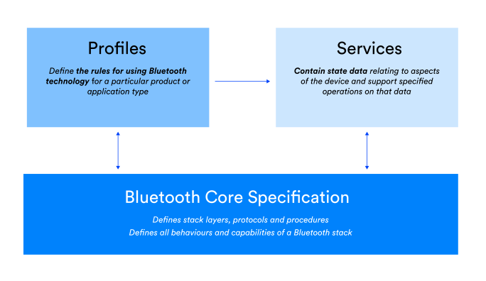

### 4.1 蓝牙核心规范

蓝牙核心规范是 Bluetooth LE 和 Bluetooth Classic 的主要规范。该规范：

- 定义了 Bluetooth 技术的架构和各种堆栈配置的层级
- 描述并定义主要特征
- 确定支持行动的正式程序
- 定义了设备在堆栈相关层之间进行通信的协议

### 4.2 配置文件规格

当两个 Bluetooth LE 设备通过连接进行通信时，通常会形成客户端/服务器关系。服务器包含状态数据，而客户则以某种方式使用这些数据。

配置文件规范定义了相关设备所承担的角色，特别是定义了客户端设备的行为以及它应与之配合使用的连接服务器上的数据。

### 4.3 服务规格

服务器上的状态数据存在于正式定义的数据项中，这些数据项被称为特征和描述符。特征和描述符被组合在称为服务的结构中。服务提供了一种环境，在这种环境中，可以为它们所包含的特征和描述符赋予意义和行为。

服务规范定义了单个服务及其包含的特征和描述符。

### 4.4 协议规格

一些标准化的 Bluetooth 应用程序需要自己的协议，这些协议有自己的规范。Bluetooth Mesh 的主要规范是协议规范。

### 4.5 分配号码

Bluetooth LE 的各个方面都使用了唯一标识符。例如，所有服务、特性和描述符都有一个通用唯一标识符（UUID）。公司可以通过唯一的公司标识符来识别。

蓝牙 SIG 分配的标识符称为分配号码，完整列表可从蓝牙技术 SIG 网站上的分配号码页面获取。

## 5. Bluetooth LE 堆栈

### 5.1 高级架构

Bluetooth LE 协议栈由许多层和功能模块组成。协议栈的这些部分分布在两个主要架构模块中，即 Host 和 Controller。标准逻辑接口定义了这两个组件的通信方式。

Host 通常是类似操作系统的东西。Controller 通常是芯片上的系统。

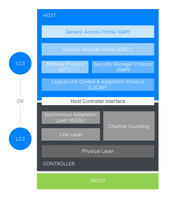

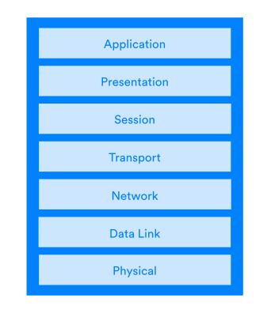

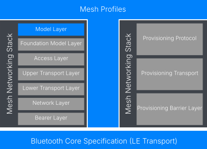

### 5.2 图层概览

| 层 | 主要职责 |
| --- | --- |
| 物理层 | 定义了蓝牙技术中与射频（RF）使用相关的所有方面，包括调制方案、频段、信道使用、发射器和接收器特性。 |
| 链路层 | 定义了空中接口数据包格式、比特流处理程序、状态以及空中通信和链路控制协议。 |
| Channel Sounding | 为设备提供测量能力，应用可利用测量结果计算与另一设备的距离。 |
| 等时适配层（ISOAL） | 允许使用等时通信的设备使用不同的帧持续时间。执行成帧 PDU 的分段和重组。 |
| Host Controller 接口（HCI） | 为 Host 组件和 Controller 之间的命令和数据双向通信提供定义明确的功能接口。 |
| 逻辑链路控制和适配协议（L2CAP） | 在 Host 内充当协议多路复用器。在下层和上层之间执行 PDU/SDU 的分段和重新组装。 |
| 安全管理器协议（SMP） | 执行配对等安全程序时使用的协议。 |
| 属性协议（ATT） | ATT 客户端和 ATT 服务器使用的协议，允许发现和使用服务器属性表中的数据。 |
| 通用属性配置文件（GATT） | 定义使用 ATT 处理属性表的高级程序。 |
| 通用访问配置文件（GAP） | 定义了在非连接状态下可能使用的操作模式和程序。 |

## 6. 物理层

Bluetooth LE 的物理层定义了如何使用无线电发射器对传输和接收的数字数据进行编码和解码。

### 6.1 频带

Bluetooth LE 在 2400 MHz 至 2483.5 MHz 范围内的 2.4 GHz 非授权频段上运行，该频段分为 40 个信道，每个信道的宽度为 2 MHz。

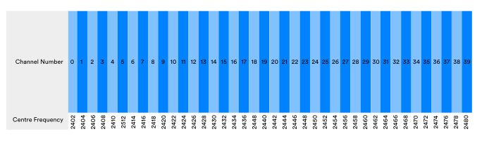

### 6.2 调制方案

#### 6.2.1 高斯频移键控

Bluetooth LE 采用高斯频移键控（GFSK）调制方案。GFSK 的工作原理是采用选定信道的中心频率信号，并将其上移一定量以表示数字值 1，或下移相同量以表示二进制值 0。

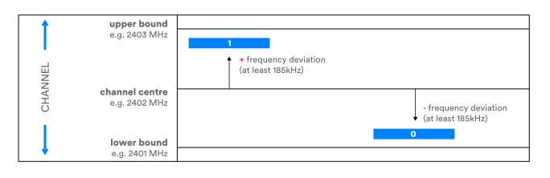

#### 6.2.2 振幅偏移键控

信道探测的某些传输使用振幅偏移键控（ASK）调制方案。ASK 是一种二进制调制方案，有两种符号状态。

### 6.3 物理层变体

| LE 1M | 低功耗编码 S=2 | 低功耗编码 S=8 | 低功耗 2M | 低功耗 2M 2BT |
| --- | --- | --- | --- | --- |
| 符号率 | 1 Ms/s | 1 Ms/s | 1 Ms/s | 2 Ms/s | 2 Ms/s |
| 协议数据速率 | 1 Mbit/s | 500 Kbit/s | 125 Kbit/s | 2 Mbit/s | 2 Mbit/s |
| 最大应用数据速率 | 800 kbps | 400 kbps | 100 kbps | 1400 kbps | N/A |
| BT | 0.5 | 0.5 | 0.5 | 0.5 | 2.0 |
| 纠错 | 无 | FEC | FEC | 无 | 无 |
| 范围乘数（约） | 1 | 2 | 4 | 0.8 | 0.8 |
| 要求 | 强制性 | 可选 | 可选 | 可选 | 可选 |

### 6.4 分时

Bluetooth LE 无线电设备是一种半双工设备，但所有 PHY 都采用时分双工（TDD）方案，因此看起来像是全双工无线电。

### 6.5 传输功率和接收器灵敏度

物理层定义了发射器特性，最大功率设置时的输出功率水平应在 0.01 mW（-20 dBm）和 100 mW（+20 dBm）之间。

### 6.6 天线切换

#### 6.6.1 方向查找

Bluetooth LE 支持两种计算接收信号传输方向的方法：到达角（Angle of Arrival）和出发角（Angle of Departure）。

#### 6.6.2 Bluetooth 信道探测

蓝牙信道探测允许在一个或两个设备中使用一个以上的天线。

## 7. 链路层

### 7.1 链路层概述

链路层定义了在空中传输的几种数据包类型以及相关的空中接口协议。它的运行受制于定义明确的状态。

### 7.2 数据包

链路层定义了两种数据包类型。第一种由未编码 PHY 使用，第二种由低功耗编码 PHY 使用。

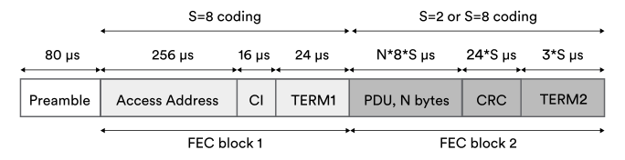

| 链路层包裹字段 | 说明 |
| --- | --- |
| 序言 | 前导码允许接收器精确同步信号频率、执行自动增益控制和估计符号定时。 |
| 访问地址 | 接收器使用地址来区分信号和背景噪声，并确定数据包是否与接收设备相关。 |
| CRC | 循环冗余校验用于错误检测。 |

### 7.3 状态

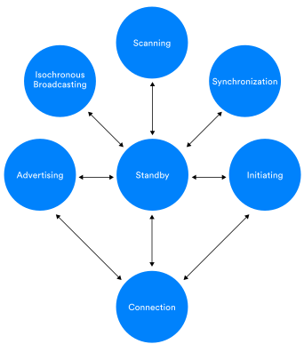

| 状态 | 说明 |
| --- | --- |
| 备用 | 设备既不发送也不接收数据包。 |
| 启动 | 响应来自特定设备的广告数据包，请求连接。 |
| 广告 | 传输广告数据包。 |
| 连接 | 在与其他设备连接时。 |
| 扫描 | 监听来自其他设备的广告数据包。 |
| 等时广播 | 广播等时数据包。 |
| 同步 | 监听由特定设备传输的周期性广播。 |

### 7.4 频道选择

Bluetooth LE 将 2.4 GHz 频段划分为 40 个信道。链路层控制这些信道的使用方式。

Bluetooth LE 使用自适应跳频技术，在一段时间内通过多个信道进行数据通信。信道是通过信道选择算法和信道图来选择的，信道图将每个信道分为已使用和未使用两种。

### 7.5 过滤器策略

链路层能够利用各种标准过滤接收到的数据包。过滤策略以一种模式运行，默认模式不会过滤数据包。其他模式通常使用过滤接受列表（Filter Accept List）。

定义了一组特殊的过滤策略模式，称为基于决策的广告过滤（DBAF）。

### 7.6 监测广告设备

#### 7.6.1 过滤和存在

广告可用作无连接通信传输，但最常见的用途可能是实现设备发现。

监测广告设备功能允许过滤重复的广告数据包，但不会失去跟踪设备是否仍然存在以及其信号强度是否足以保证连接到该设备的能力。

#### 7.6.2 使用广告监测

LE 控制器会维护一个名为"监测广告商列表"的列表。

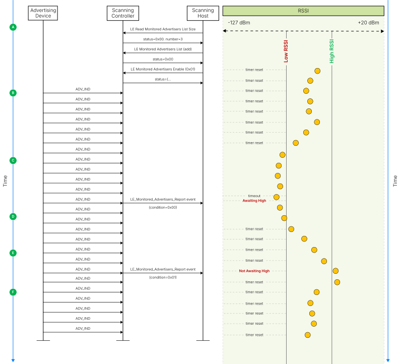

### 7.7 数据传输架构

蓝牙核心规范的架构部分定义了一系列概念，包括物理通道、物理链路、逻辑链路和逻辑传输。

### 7.8 逻辑传输

#### 7.8.1 LE ACL - LE 面向逻辑传输的异步连接

**7.8.1.1 基础知识**

当两台 Bluetooth LE 设备连接时，它们使用的是面向连接的异步逻辑传输（LE-ACL）。

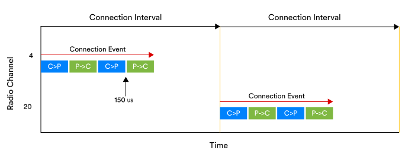

**7.8.1.2 排序和确认**

LE-ACL 包含一个系统，可确保按正确的顺序处理数据。

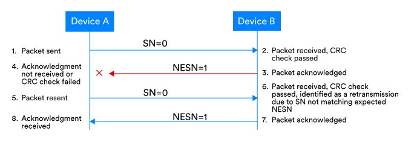

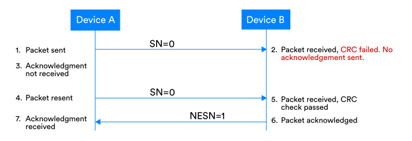

**7.8.1.3 外设延迟**

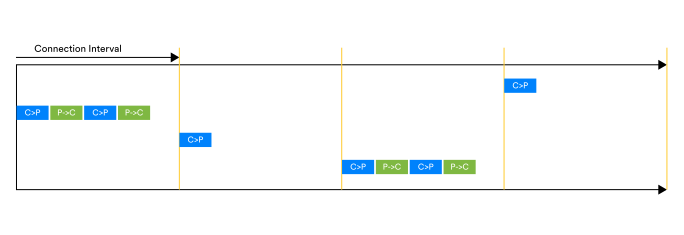

**7.8.1.4 频道使用**

LE-ACL 采用自适应跳频方案。在 40 个通道中，有 37 个通用通道可供 LE-ACL 连接使用。

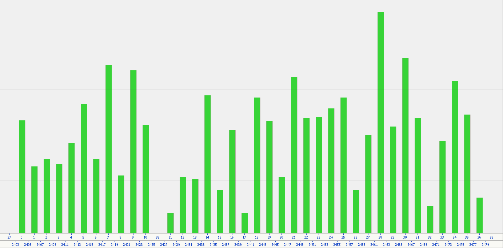

**7.8.1.5 链路层控制**

| 控制程序 | 说明 |
| --- | --- |
| 连接更新 | 允许更改连接参数。 |
| 更新通道图 | 允许中央设备传输最新通道图数据。 |
| 加密 | 允许启用数据包加密。 |
| 功能交换 | 交换每个设备支持的链路层功能。 |
| CIS 创建 | 允许中心设备与外设创建连接等时数据流。 |
| 电源控制请求 | 请求调整传输功率级别。 |
| 通道分类报告 | 允许外设报告通道分类数据。 |

**7.8.1.6 分级连接**

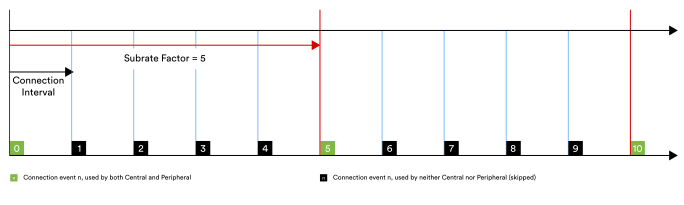

#### 7.8.2 ADVB - LE 广告广播

**7.8.2.1 基础知识**

LE 广告广播提供了一种无连接通信模式。蓝牙核心规范定义了两类广告程序：传统广播和扩展广播。

**7.8.2.2 传统广播**

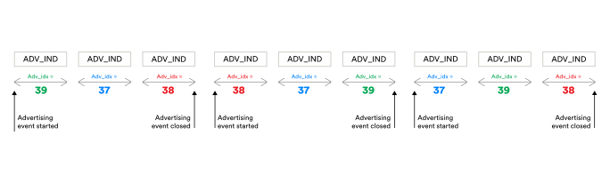

传统广播 PDU：

| PDU 名称 | 说明 | 信道 | PHY | 可扫描 | 可连接 |
| --- | --- | --- | --- | --- | --- |
| ADV_IND | 非定向广告 | 主 | LE 1M | Y | Y |
| ADV_DIRECT_IND | 定向广告 | 主 | LE 1M | N | Y |
| ADV_NONCON_IND | 非连接、非扫描广告 | 主 | LE 1M | N | N |
| ADV_SCAN_IND | 可扫描广告 | 主 | LE 1M | Y | N |
| SCAN_REQ | 扫描请求 | 主 | LE 1M | - | - |
| SCAN_RSP | 扫描响应 | 主 | LE 1M | - | - |
| CONNECT_IND | 连接请求 | 主 | LE 1M | - | - |

**7.8.2.3 扩展广播**

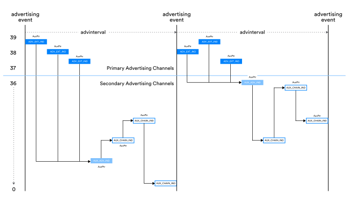

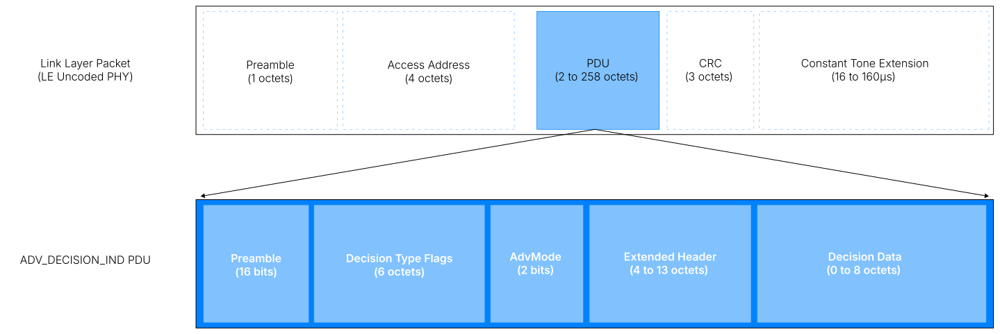

**7.8.2.4 比较传统广播和扩展广播**

| 特性 | 传统广播 | 扩展广播 |
| --- | --- | --- |
| 最大广告数据 | 31 字节 | 1,650 字节 |
| 每包最大数据 | 31 字节 | 254 字节 |
| 发射信道 | 37, 38, 39 | 0-39 |
| PHY 支持 | LE 1M | LE 1M, LE 2M, LE Coded |
| 最大广告配置 | 1 | 16 |
| 通信类型 | 异步 | 异步 + 同步 |

#### 7.8.3 PADVB - LE 周期性广播

**7.8.3.1 基础知识**

周期性广播涉及按照确定的时间表传送数据包，并提供一种机制使其他设备能够同步扫描。

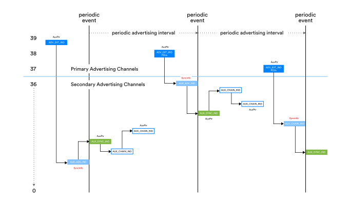

#### 7.8.4 带响应的周期性广播

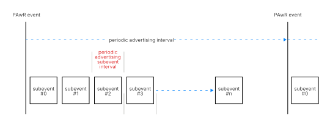

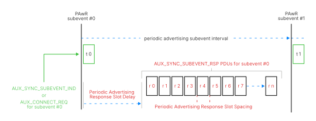

#### 7.8.5 LE BIS 和 LE CIS - 等时通信

**7.8.5.1 基础知识**

等时通信为使用 Bluetooth LE 在设备间传输有时间限制的数据提供了一种方法。

**7.8.5.2 连接的等时数据流（CIS）**

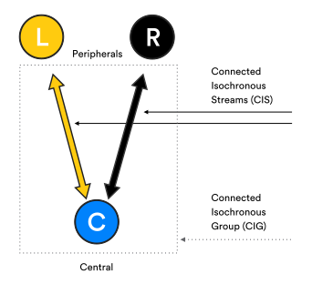

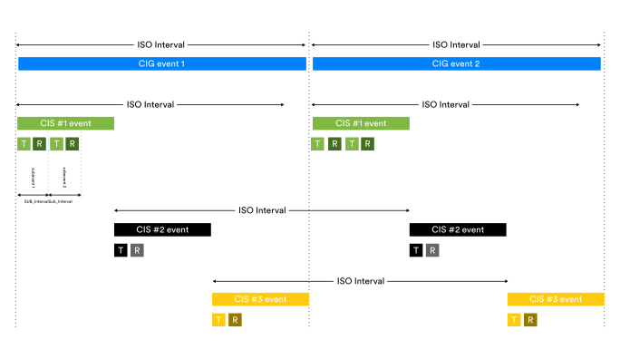

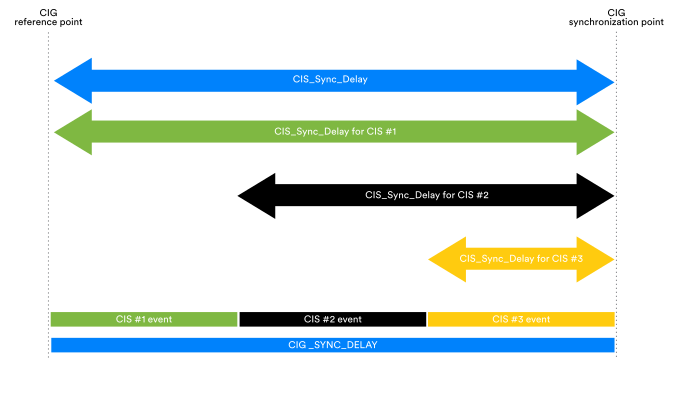

**7.8.5.3 广播等时流（BIS）**

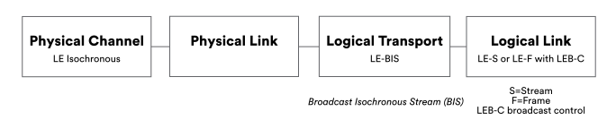

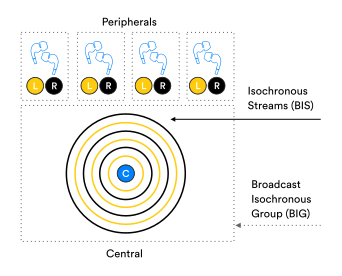

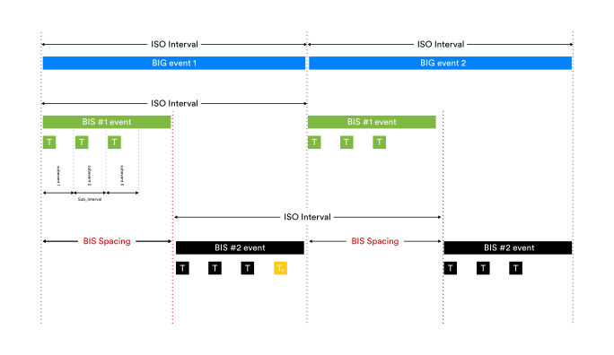

## 8. Bluetooth 信道探测

### 8.1 介绍 Bluetooth 信道探测

蓝牙信道探测是 Bluetooth LE 控制器的一项可选功能。Bluetooth 信道探测比使用 RSSI 的方法更准确、更可靠、更安全，在 100 米距离内精确度可达 +/- 20 厘米。

### 8.2 设备角色

### 8.3 Bluetooth 信道探测数据传输架构

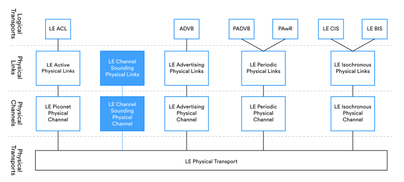

### 8.4 两种 Bluetooth 信道探测方法

#### 8.4.1 PBR

PBR 利用无线电传输中波的属性来测量距离。

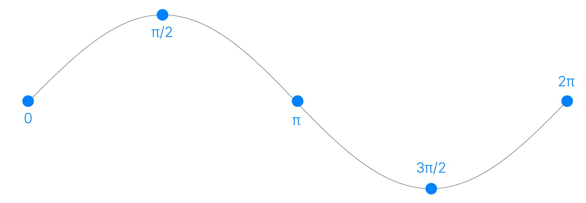

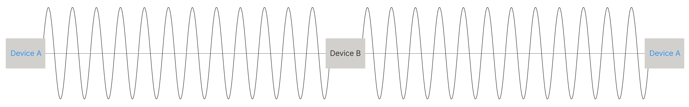

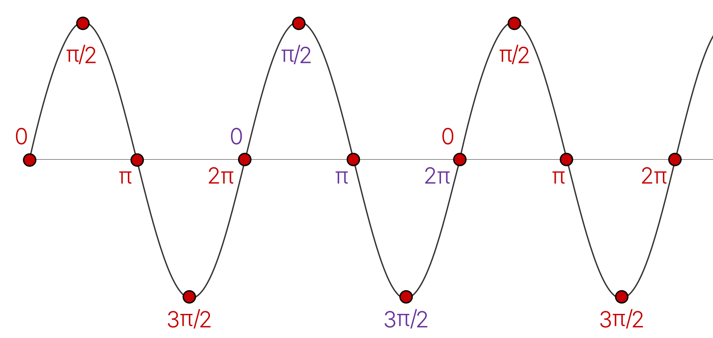

#### 8.4.2 往返计时（RTT）

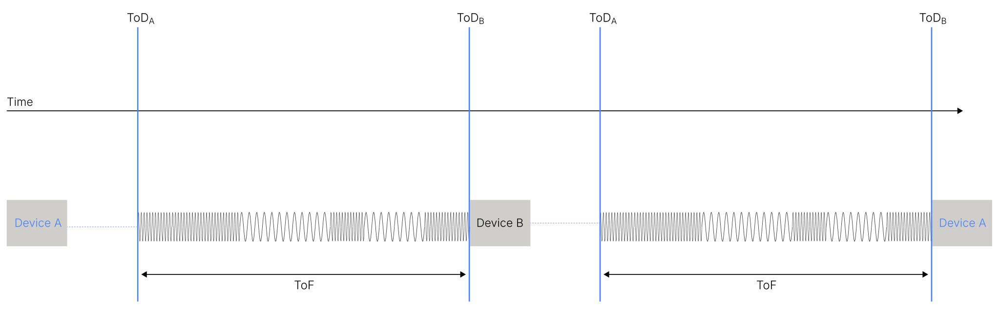

### 8.5 Bluetooth 信道探测链路层控制程序

#### 8.5.1 信道探测安全启动

在安全启动过程中，两台设备交换 CS_IV、CS_IN 和 CS_PV 参数。

#### 8.5.2 信道探测能力交换

共定义了 22 个信道探测功能参数，设备需交换功能信息。

#### 8.5.3 信道探测配置

根据功能信息交换选定配置。

#### 8.5.4 模式 0 FAE 表请求

分频偏移执行误差（FAE）数据交换用于校准。

#### 8.5.5 信道探测启动

交换 LL_CS_REQ、LL_CS_RSP 和 LL_CS_IND 启动信道探测。

### 8.6 时间划分

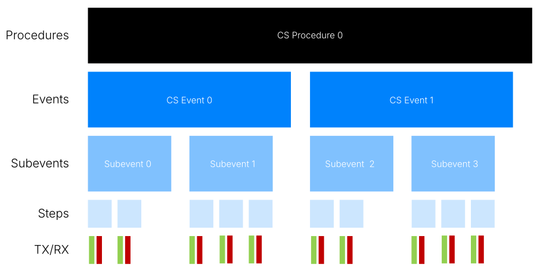

### 8.7 数据包和音调

在 CS 步骤中进行的射频活动有两种形式：数据包（GFSK 调制）和音调（无数据的无线电传输）。

### 8.8 步骤和模式

#### 8.8.1 模式-0

模式-0 用于校准。

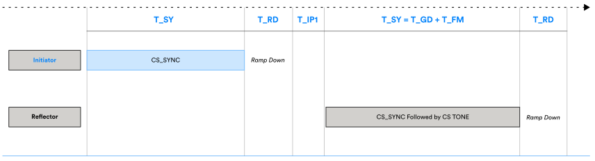

#### 8.8.2 模式-1

模式-1 涉及 RTT 法。

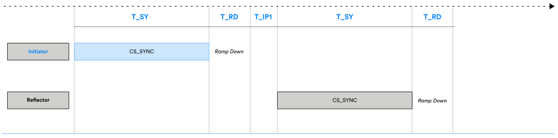

#### 8.8.3 模式-2

模式-2 涉及 PBR。

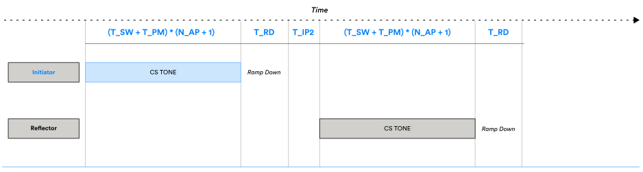

#### 8.8.4 模式-3

模式-3 支持在单步中同时使用 RTT 和 PBR。

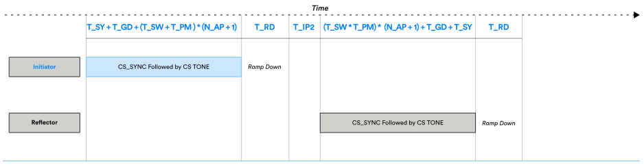

### 8.9 模式排序

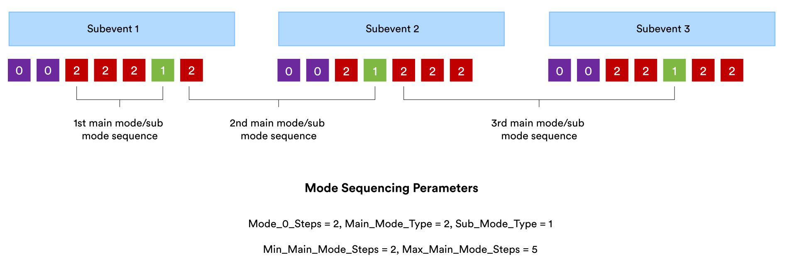

允许的非模式 0 组合：

| 主模式 | 子模式 |
| --- | --- |
| 模式-1 | 无 |
| 模式-2 | 无 |
| 模式-3 | 无 |
| 模式-2 | 模式-1 |
| 模式-2 | 模式-3 |
| 模式-3 | 模式-2 |

### 8.10 信道和信道选择

#### 8.10.1 射频通道

Bluetooth 信道探测使用 79 个 1 MHz 宽的信道，其中 72 个可用于信道探测。

#### 8.10.2 信道过滤

使用信道索引过滤位图，标记信道为包含或排除。

#### 8.10.3 信道选择和跳频

定义了三种专用信道选择算法：CSA #3a、CSA #3b 和 CSA #3c。

### 8.11 天线切换和天线路径

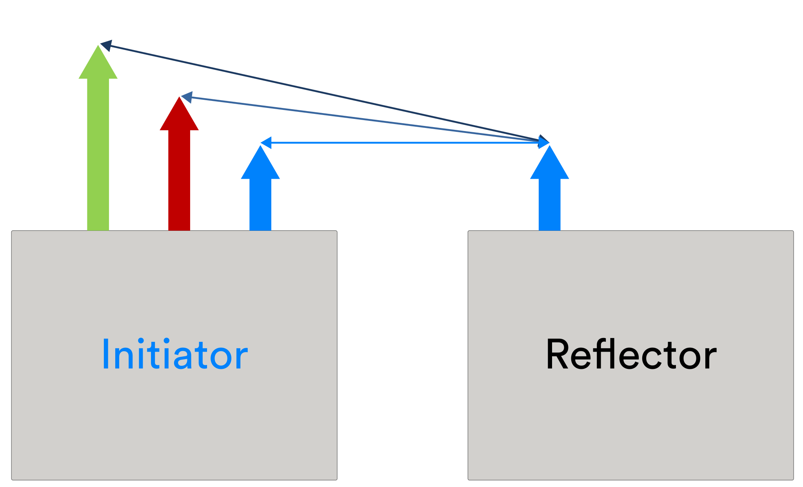

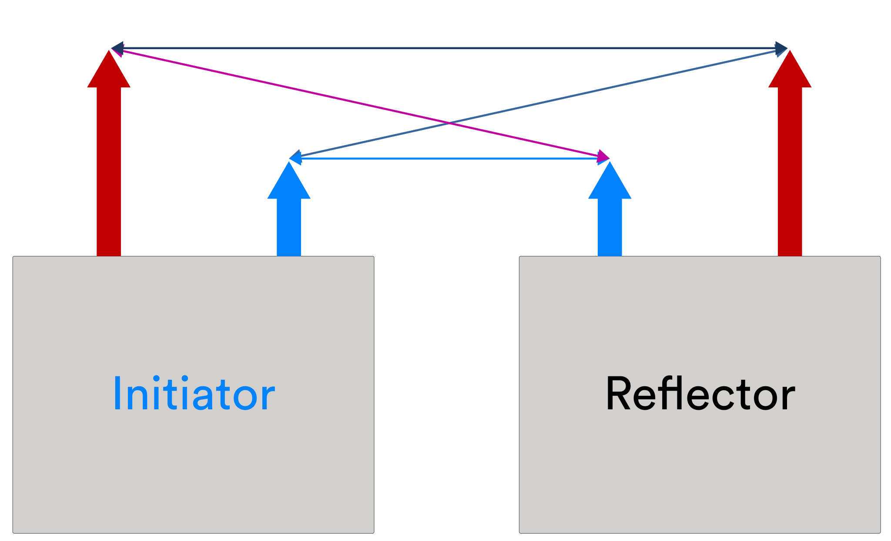

### 8.12 RTT 和准确性

捕捉时间戳的准确性至关重要。蓝牙核心规范介绍了多种方法，包括访问地址法和分段时间估计法。

### 8.13 安全

#### 8.13.1 欺骗

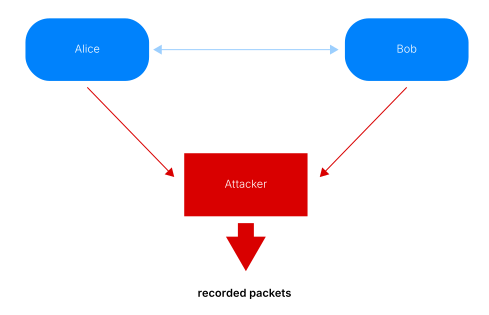

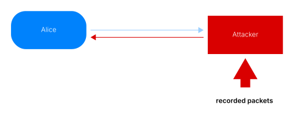

#### 8.13.2 中继攻击

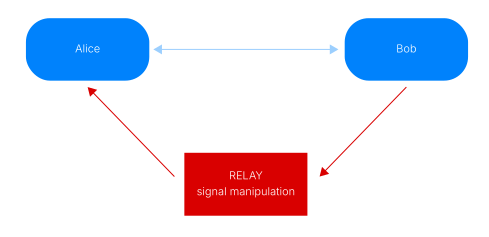

#### 8.13.3 Bluetooth 信道探测安全功能

安全功能分为四类：

1. **同时使用 PBR 和 RTT 法** - 两种方法的数据可交叉检查
2. **比特流和传输模式的随机化** - 使用确定性随机比特发生器（DRBG）
3. **防范符号操纵** - 使用 LE 2M 2BT PHY 和 SNR 控制
4. **射频信号分析和攻击检测** - 使用归一化攻击检测度量（NADM）

### 8.14 距离测量应用

Bluetooth 信道探测本身并不计算距离值，而是为应用程序提供原材料（定时信息、IQ 样本等）。

## 9. 等时适配层

### 9.1 基本知识

#### 9.1.1 音频采样 101

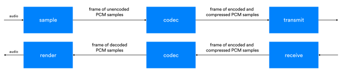

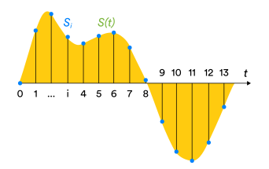

#### 9.1.2 编解码器和帧

编解码器一次分析的样本集合称为一帧。帧有固定的持续时间，通常以毫秒为单位。

### 9.2 有框与无框

当设备使用等时通信时，发送设备和接收设备使用的帧持续时间不必相同。

### 9.3 分裂与重组

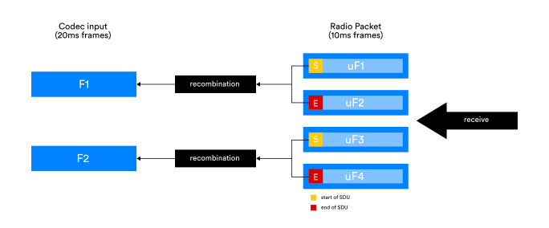

### 9.4 分割和重新组装

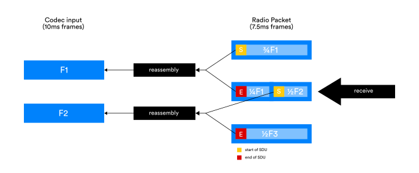

## 10. Host Controller 接口

### 10.1 基础知识

Host Controller 接口（HCI）定义了一个标准化接口，Host 可通过该接口向 Controller 发送命令，Controller 也可通过该接口与 Host 通信。

### 10.2 HCI 功能规范

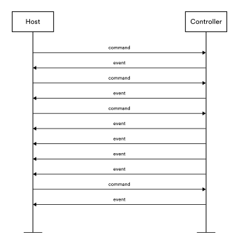

### 10.3 HCI 传输

四种 HCI 传输类型：UART、USB、安全数字（SD）和三线制 UART。

### 10.4 HCI 示例

#### 10.4.1 无连接到达角

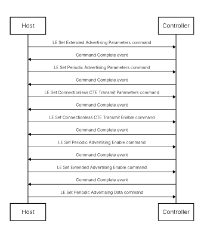

#### 10.4.2 LE 路径损耗监测

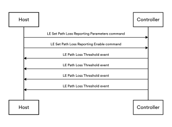

#### 10.4.3 主动扫描

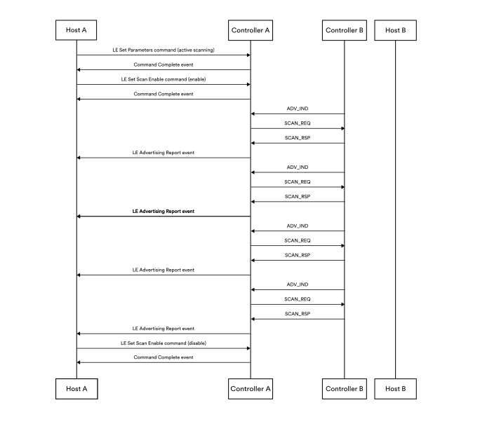

## 11. 逻辑链路控制和适配协议

### 11.1 基本知识

逻辑链路控制和适配协议（L2CAP）负责协议复用、流量控制以及 SDU 的分段和重新组装。

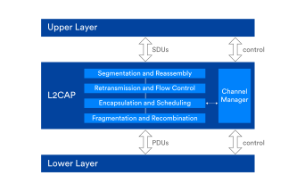

### 11.2 L2CAP 和协议复用

L2CAP 协议复用可确保 SDU 在堆栈中向上传递到相应层进行处理。

### 11.3 L2CAP 和流量控制

基于信用的流量控制允许发送设备了解接收设备的容量。

### 11.4 L2CAP 分段和重新组装

L2CAP 本身和堆栈中的上下层可能具有不同的 MTU 大小。

## 12. 属性协议

### 12.1 基本知识

属性协议（ATT）中，服务器提供一系列称为属性的复合数据项。每个属性包含句柄、UUID、值和权限。

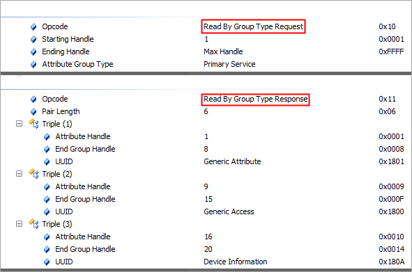

### 12.2 ATT PDU

属性协议定义了 31 个不同的 PDU。

#### 12.2.1 命令

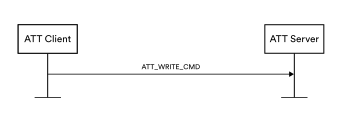

#### 12.2.2 请求和回复

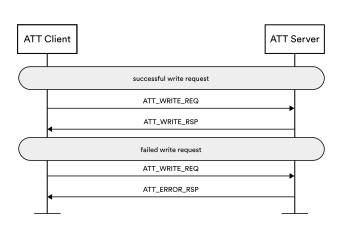

#### 12.2.3 通知

#### 12.2.4 指示和确认

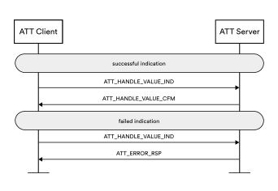

#### 12.2.5 PDU 格式

所有 ATT PDU 包括操作码、参数和可选签名。

#### 12.2.6 最大传输单元

ATT PDU 的最大长度取决于已建立的 MTU 值。

### 12.3 事务

ATT 采用顺序事务模式，请求/响应对须在 30 秒内完成。

### 12.4 承载

ATT 有两种承载：非增强 ATT 承载和增强 ATT 承载（EATT）。

### 12.5 发现对 EATT 的支持

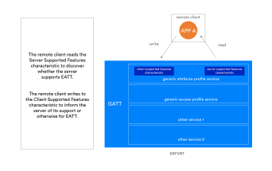

## 13. 通用属性配置文件

### 13.1 基本知识

GATT 定义了服务、特征和描述符。

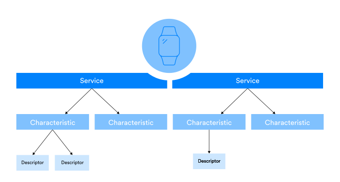

### 13.2 Bluetooth SIG vs Custom

蓝牙 SIG 定义的类型使用 16 位 UUID，自定义类型使用 128 位 UUID。

### 13.3 程序

GATT 程序包括服务发现、特征发现、描述符发现、读写特征值以及通知和指示。

### 13.4 示例

#### 13.4.1 Bluetooth SIG 定义属性

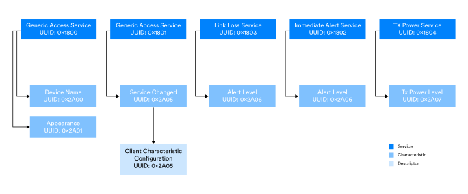

#### 13.4.2 Bluetooth SIG 和自定义属性的混合

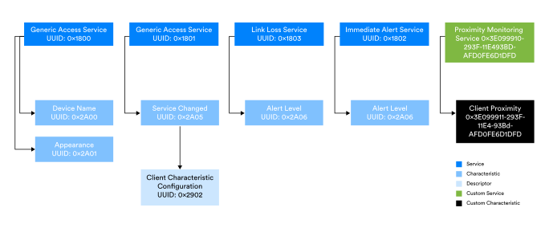

## 14. 通用接入配置文件

### 14.1 基础知识

通用访问配置文件（GAP）定义了与设备发现和建立连接有关的程序。

### 14.2 角色

| 角色 | 说明 |
| --- | --- |
| 广播者 | 使用广告以无连接方式传输数据的设备。 |
| 观察者 | 接收广告数据包的设备。 |
| 外围设备 | 可与中心设备连接的设备。 |
| 中心 | 可以启动与外围设备连接的设备。 |

### 14.3 发现

设备可处于不可发现模式、一般可发现模式或有限可发现模式。

### 14.4 连接模式

广告设备可通过 PDU 类型或 AdvMode 字段表明是否可连接。

### 14.5 定向与非定向

定向广告涉及的 PDU 包含 TargetA 字段（目标设备地址）。

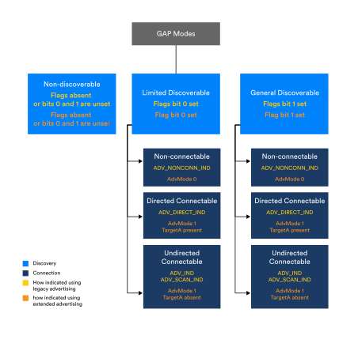

### 14.6 可扫描与不可扫描

某些广告 PDU 类型是可扫描的，接收设备可用扫描请求 PDU 响应以请求更多数据。

### 14.7 GAP 和 LE 安全

GAP 规范定义了安全术语、模式和程序。

### 14.8 周期性广播

GAP 规定了广播者进入周期性广播模式和观察者同步的程序。

### 14.9 等时广播

GAP 规定了等时通信中广播者和观察者的程序。

## 15. 安全管理器协议

### 15.1 基本知识

安全管理器协议（SMP）支持配对、绑定和密钥分配等安全程序。

### 15.2 示例

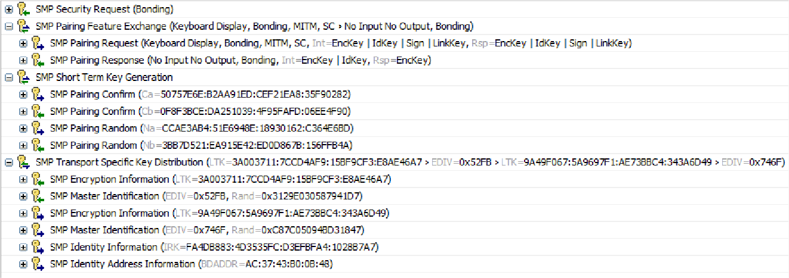

## 16. Bluetooth LE 的安全性

Bluetooth LE 提供了一系列安全功能和特性。产品团队有责任满足安全要求，应通过使用选定的 Bluetooth LE 安全功能来实现。

## 17. 应用

Bluetooth LE 功能通过应用程序来实现。在承诺开发应用之前要做研究，查看 API 文档以确定对所需功能的支持。

## 18. 额外资源

| 资源 | 说明 |
| --- | --- |
| 蓝牙核心规范 | 关键技术规范，定义了蓝牙堆栈的所有层。 |
| 配置文件和服务规格 | 定义了 GATT 服务和配置文件。 |
| LC3 编解码器 | 低功耗音频使用的低复杂度通信编解码器。 |
| 蓝牙低功耗开发入门 | 开发人员的教育资源。 |
| 了解 Bluetooth LE 安全性 | 安全性的学习指南。 |
| 面向 Linux 开发人员的蓝牙技术 | Linux 开发人员的教育资源。 |
| 蓝牙核心规范 v6.0 功能概述 | 包括信道探测、DBAF 和监测广告设备。 |
| 蓝牙信道探测技术概述 | 详细介绍蓝牙信道探测技术。 |

---

*© 2026 蓝牙技术联盟（SIG, Inc.）。保留所有权利。*
