# BLE 基础知识整理

> 基于《BLE基础培训框架》整理，按知识主题分章节归类，涵盖协议栈、广播、连接、GATT、安全及应用场景的完整知识点与习题解答。

---

## 目录

1. [BLE 概述](#1-ble-概述)
2. [协议栈分层结构](#2-协议栈分层结构)
3. [物理层与射频信道](#3-物理层与射频信道)
4. [链路层（Link Layer）](#4-链路层link-layer)
5. [GAP 通用访问配置文件](#5-gap-通用访问配置文件)
6. [广播机制](#6-广播机制)
7. [连接机制](#7-连接机制)
8. [L2CAP](#8-l2cap)
9. [ATT 属性协议](#9-att-属性协议)
10. [GATT 通用属性配置文件](#10-gatt-通用属性配置文件)
11. [SMP 安全管理协议](#11-smp-安全管理协议)
12. [功耗优化](#12-功耗优化)
13. [应用场景：基于广播的遥控控制](#13-应用场景基于广播的遥控控制)
14. [应用场景：基于连接的 GATT 控制](#14-应用场景基于连接的-gatt-控制)
15. [习题解答](#15-习题解答)
16. [核心参数速查与常见问题排查](#16-核心参数速查与常见问题排查)
17. [参考资料下载](#参考资料下载)

---

## 1. BLE 概述

| 项目 | 内容 |
|------|------|
| 全称 | Bluetooth Low Energy（低功耗蓝牙） |
| 引入版本 | 蓝牙规范 4.0（2010年） |
| 定位 | 短距离、超低功耗无线通信，专为低占空比场景设计 |
| 频段 | 2.4 GHz ISM 频段 |
| 调制方式 | GFSK（高斯频移键控） |
| 典型应用 | 传感器、穿戴设备、Beacon、遥控器、智能家居 |

**BLE 关键特性：**

- 休眠电流在 μA 级，纽扣电池可工作数年
- 连接建立时间 < 6 ms
- 40 个 2 MHz 射频信道（3 个广播信道 + 37 个数据信道）
- 最大发射功率 +10 dBm；室内覆盖约 10–30 m，开阔场地可达 100 m+

**与经典蓝牙（BR/EDR）对比：**

| 对比项 | BLE | BR/EDR |
|--------|-----|--------|
| 功耗 | 极低（μA 级休眠） | 较高（mA 级） |
| 速率 | 125 kbps – 2 Mbps | 1 – 3 Mbps |
| 连接延迟 | < 6 ms | 约 100 ms |
| 主要用途 | 传感器、信标、遥控 | 音频、文件传输 |
| 互操作性 | 不兼容 BR/EDR | 不兼容 BLE |

---

## 2. 协议栈分层结构

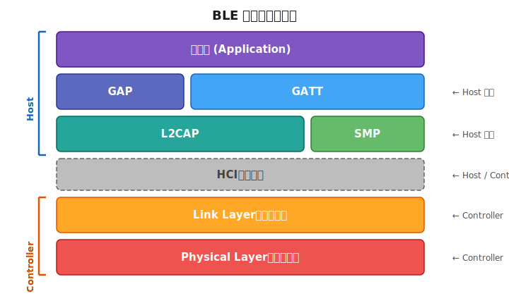

各层职责总览：

| 层 | 缩写 | 职责 |
|----|------|------|
| 物理层 | PHY | 射频收发、GFSK 调制解调，管理 40 个信道 |
| 链路层 | LL | 状态机、数据包格式、CRC 校验、ARQ 重传、跳频、加密 |
| HCI | HCI | Host 与 Controller 之间的标准化命令/事件接口，单芯片方案可省略 |
| L2CAP | L2CAP | 逻辑信道复用，数据分段（SDU → PDU）与重组 |
| 安全管理层 | SMP | 配对与密钥分发，提供加密和身份认证服务 |
| 属性协议 | ATT | Client/Server 模型的属性读写协议，运行于 L2CAP 之上 |
| 通用属性配置文件 | GATT | 基于 ATT 定义 Profile/Service/Characteristic 的组织与操作规范 |
| 通用访问配置文件 | GAP | 定义设备角色、广播行为、连接流程的通用访问接口 |

> **Host vs Controller 的划分：** 物理层和链路层属于 Controller，其余属于 Host。两者通过 HCI 通信。单芯片集成方案中 HCI 是内部接口，双芯片方案（如 MCU + BLE 芯片）中 HCI 通过 UART/SPI 暴露。

---

## 3. 物理层与射频信道

### 信道划分

BLE 共有 **40 个** 射频信道，信道间隔 2 MHz，频率范围 2402–2480 MHz：

- **3 个主广播信道**：信道 37（2402 MHz）、38（2426 MHz）、39（2480 MHz）
- **37 个数据信道**：信道 0–36，用于连接通信和扩展广播辅助包

**广播信道选择原因：** 三个信道分别位于 Wi-Fi 2.4 GHz 的信道 1（2412 MHz）、6（2437 MHz）、11（2462 MHz）的频率间隙，尽量避开 Wi-Fi 干扰。

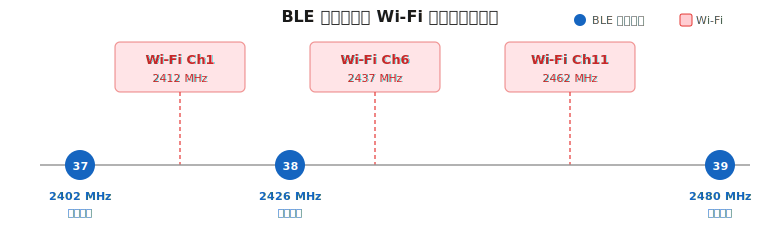

### PHY 类型（BLE 版本演进）

| PHY | 引入版本 | 速率 | 特点 |
|-----|---------|------|------|
| 1M PHY | BLE 4.0 | 1 Mbps | 通用标准 PHY，兼容所有 BLE 设备 |
| 2M PHY | BLE 5.0 | 2 Mbps | 更高吞吐量，瞬时功耗略高但传输总能耗更低 |
| Coded PHY (S=2) | BLE 5.0 | 500 kbps | 更远距离，抗干扰性强 |
| Coded PHY (S=8) | BLE 5.0 | 125 kbps | 最远距离（~4× 1M PHY） |

### 1M PHY 详解

**PHY** 是 **Physical Layer（物理层）** 的缩写，**1M PHY** 表示速率为 **1 Mbps** 的物理层模式。

| 参数 | 说明 |
|------|------|
| 全称 | 1 Megabit PHY |
| 调制方式 | GFSK（高斯频移键控） |
| 兼容性 | 所有 BLE 设备必须支持 |
| 默认行为 | 广播包默认在 1M PHY 上发送；连接建立后默认使用 1M PHY |

**1M PHY 的核心特点：**

- **兼容性最强**：BLE 4.0 起的所有设备均支持，是唯一的强制 PHY 模式
- **广播默认**：Legacy 广播（ADV_IND 等）始终在 1M PHY 上发送
- **连接默认**：连接建立时协商使用 1M PHY，可通过 PHY Update 流程切换到 2M PHY 或 Coded PHY
- **功耗平衡**：速率与功耗之间取得较好平衡，适合大多数应用场景

**PHY Update 流程（连接后切换 PHY）：**

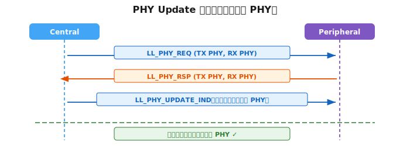

**常见 PHY 定义（代码示例）：**

```c
#define BLE_GAP_PHY_1MBPS   0x01  // 1M PHY
#define BLE_GAP_PHY_2MBPS   0x02  // 2M PHY
#define BLE_GAP_PHY_CODED   0x04  // Coded PHY（S=2 或 S=8）
```

### 2M PHY 详解

**2M PHY** 是 BLE 5.0 引入的高速物理层模式，调制符号率提升至 2 Msym/s，传输速率是 1M PHY 的两倍。

| 参数 | 说明 |
|------|------|
| 全称 | 2 Megabit PHY |
| 调制方式 | GFSK（高斯频移键控，符号率 2 Msym/s） |
| 引入版本 | BLE 5.0 |
| 兼容性 | 可选支持，需双方均支持才能切换 |

**2M PHY 的核心特点：**

- **速率翻倍**：相同数据量传输时间减半，空中传输时间（Time on Air）缩短 50%
- **瞬时功耗略高**：更高的符号率要求射频电路运行在更高频率，瞬时电流略大于 1M PHY
- **传输总能耗更低**：虽然瞬时功耗略高，但射频活跃时间减半，发送同等数据的总能耗反而降低
- **距离略减**：更高符号率对信噪比要求提高，覆盖距离比 1M PHY 略小
- **典型用途**：大数据量传输（固件 OTA 升级、音频数据）、需要高吞吐量的应用

### Coded PHY 详解

**Coded PHY** 是 BLE 5.0 引入的远距离物理层模式，通过**前向纠错编码（FEC）** 在牺牲速率的同时大幅提升传输距离和抗干扰能力。

**编码原理：**

Coded PHY 在链路层对数据进行冗余编码——每 1 个信息 bit 用多个符号（chip）表示：

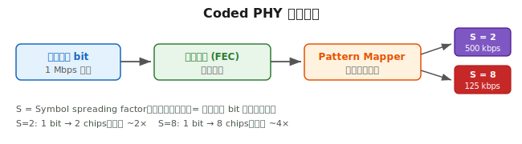

- **S** 代表 **Symbol spreading factor（符号扩频因子）**，即每个信息 bit 对应的符号数

#### Coded PHY (S=2)

| 参数 | 说明 |
|------|------|
| 有效数据速率 | 500 kbps |
| 扩频因子 | S=2（1 bit → 2 chips） |
| 距离增益 | 约为 1M PHY 的 **2 倍** |
| 功耗代价 | 射频活跃时间是 1M PHY 的 2 倍 |
| 编码方式 | 卷积码（rate 1/2）+ FEC |

**适用场景：** 需要适当增加覆盖距离，同时保持较高数据吞吐量，如工业传感器、楼宇自动化。

#### Coded PHY (S=8)

| 参数 | 说明 |
|------|------|
| 有效数据速率 | 125 kbps |
| 扩频因子 | S=8（1 bit → 8 chips） |
| 距离增益 | 约为 1M PHY 的 **4 倍**（理论最远） |
| 功耗代价 | 射频活跃时间是 1M PHY 的 8 倍 |
| 编码方式 | 卷积码（rate 1/2）+ 模式映射（rate 1/4）+ FEC |

**适用场景：** 超远距离低频传输，如地下室传感器、户外资产追踪、穿墙覆盖场景。

**四种 PHY 横向对比：**

| PHY | 速率 | 相对距离 | 空中时间（同等数据） | 典型场景 |
|-----|------|---------|------------------|----------|
| 1M PHY | 1 Mbps | 1× | 1× | 通用场景，默认选择 |
| 2M PHY | 2 Mbps | ~0.8× | 0.5× | 高速传输、OTA 升级 |
| Coded S=2 | 500 kbps | ~2× | 2× | 中远距离传感器 |
| Coded S=8 | 125 kbps | ~4× | 8× | 超远距离、穿墙覆盖 |

> 注意：Coded PHY 的距离增益依赖于 FEC 纠错，在噪声较小的环境中增益显著；在已有强干扰的环境中，增益会有所折扣。

---

## 4. 链路层（Link Layer）

### 4.1 状态机

链路层共有 **5 种状态**，设备任何时刻处于其中一种：

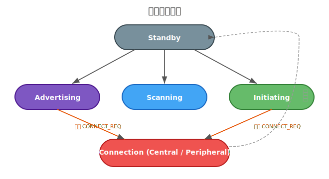

| 状态 | 说明 |
|------|------|
| Standby | 不收不发，空闲待机 |
| Advertising | 周期性在广播信道发包，等待被扫描或连接 |
| Scanning | 监听广播信道，接收广播包（被动/主动） |
| Initiating | 监听目标设备广播，准备发 CONNECT_REQ |
| Connection | 连接已建立，在数据信道双向跳频通信（分 Master/Slave 角色） |

### 4.2 PDU 格式

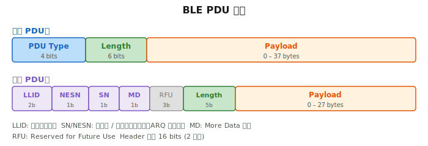

### 4.3 BLE 数据包完整封装结构

BLE 数据包从物理层到 ATT 层的嵌套关系如下：

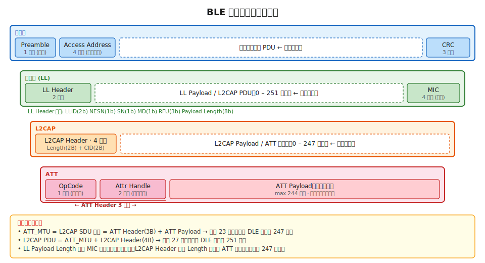

**各层长度字段关系：**

| 字段 | 含义 | 计算方式 |
|------|------|----------|
| LL Header 的 Payload Length | 包含 MIC 在内的有效净荷长度 | L2CAP PDU + MIC（如有） |
| L2CAP Header 的 Length | ATT 数据的长度（最大 247 字节） | ATT Header + ATT Payload |
| ATT_MTU | L2CAP 的 SDU 长度 | ATT Header（3 字节）+ ATT 有效负载数据 |
| L2CAP PDU 长度 | 单个连接事件数据包中传输的 LE 数据包最大大小 | ATT_MTU + L2CAP Header（4 字节） |

> **关键换算：** 默认 ATT_MTU = 23 字节 → ATT Payload = 23 - 3 = **20 字节**；L2CAP PDU = 23 + 4 = **27 字节**；LL Payload（不含 MIC）= **27 字节**。启用 DLE 后 LL Payload 最大 251 字节 → L2CAP PDU 最大 251 字节 → ATT_MTU 最大 247 字节 → ATT Payload 最大 **244 字节**。

### 4.4 ARQ 重传机制

BLE 使用**停止等待 ARQ（Stop-and-Wait ARQ）**，通过 SN 和 NESN 互相确认：

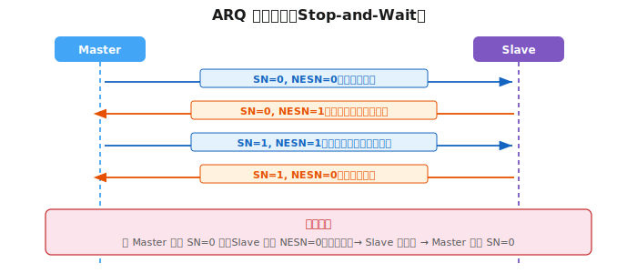

### 4.5 跳频机制（AFH）

连接状态下，BLE 在 37 个数据信道间按固定算法跳转（自适应跳频）：

```
next_channel = (current_channel + hop) mod 37
```

若计算出的信道已被标记为不可用（ChM 中对应 bit = 0）：

```
remapping_index = next_channel mod used_channel_count
next_channel    = used_channel_list[remapping_index]
```

- **Hop 值**：由 CONNECT_REQ 中的 `Hop` 字段指定，范围 5–16
- Master 和 Slave 使用相同算法独立计算，保持同步
- Controller 可随时通过 `LL_CHANNEL_MAP_IND` 更新信道映射，动态规避受干扰信道

---

## 5. GAP 通用访问配置文件

### 5.1 设备角色

GAP 定义了 4 种基本角色，决定设备在广播和连接中的行为：

| GAP 角色 | 对应 LL 状态 | 说明 |
|----------|-------------|------|
| Broadcaster | Advertising | 只发广播，不允许建立连接（使用不可连接广播类型） |
| Observer | Scanning | 只扫描，接收广播数据，不发起连接 |
| Peripheral | Advertising → Slave | 可被连接的设备；广播时可接受 CONNECT_REQ |
| Central | Initiating → Master | 主动扫描并向目标 Peripheral 发起连接 |

> 同一设备可同时扮演多个角色，如一台设备同时作为 Central（连接传感器）和 Peripheral（被手机连接）。

### 5.2 角色术语辨析：Central/Peripheral vs Master/Slave

BLE 协议栈中，**不同层对同一设备使用了不同的术语**，容易造成混淆：

| 层级 | 主设备 | 从设备 | 定义方 |
|------|--------|--------|--------|
| **GAP 层**（应用视角） | Central | Peripheral | GAP 规范 |
| **Link Layer**（链路视角） | Master | Slave | LL 规范 |

它们描述的是**同一对设备**，只是站在不同协议层：

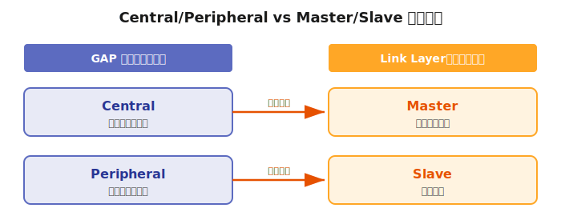

- **连接建立前**（GAP 视角）：发广播的叫 Peripheral，扫描并发起连接的叫 Central
- **连接建立后**（LL 视角）：发 CONNECT_REQ 的一方成为 Master（控制跳频序列和连接时序），接受连接的一方成为 Slave

> **术语统一趋势：** 蓝牙 SIG 从 **Bluetooth 5.3** 规范开始，正式将 LL 层的 Master/Slave 术语也改为了 Central/Peripheral，以统一命名并避免歧义。因此新规范文档和新版 SDK 中统一使用 Central/Peripheral，但旧文档、旧代码和部分芯片厂商 API 中仍会看到 Master/Slave 的写法。

### 5.3 设备地址类型

| 类型 | 说明 |
|------|------|
| Public Address | 全局唯一 MAC 地址，由 IEEE 分配，固定不变 |
| Random Static Address | 随机生成，设备重启后可变 |
| Random Private Resolvable Address (RPA) | 使用 IRK 加密生成，定期轮换，保护隐私 |
| Random Private Non-Resolvable Address | 随机生成，不可被解析，最高隐私保护 |

---

## 6. 广播机制

### 6.1 广播 PDU 类型

| PDU 类型 | 值 | 可连接 | 可扫描 | 说明 |
|----------|----|--------|--------|------|
| ADV_IND | 0x00 | ✓ | ✓ | 通用可连接广播，最常用 |
| ADV_DIRECT_IND | 0x01 | ✓ | ✗ | 定向连接广播，指定目标 Central |
| ADV_NONCONN_IND | 0x02 | ✗ | ✗ | 不可连接不可扫描，用于 Beacon |
| SCAN_REQ | 0x03 | — | — | Scanner 向 Advertiser 请求额外数据 |
| SCAN_RSP | 0x04 | — | — | Advertiser 对 SCAN_REQ 的响应 |
| CONNECT_REQ | 0x05 | — | — | Initiator 向 Advertiser 发起连接 |
| ADV_SCAN_IND | 0x06 | ✗ | ✓ | 不可连接但可扫描广播 |

### 6.2 广播数据结构（AD Structure）

广播包 Payload（最大 31 字节）由若干 AD Structure 紧密排列组成：

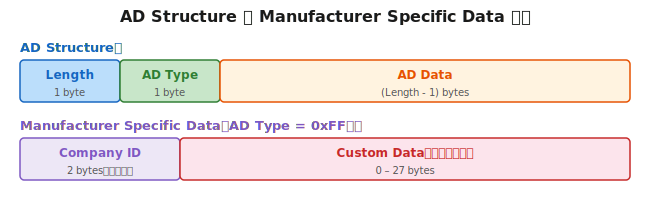

- `Length` = AD Type 字节数 + AD Data 字节数
- AD Structures 在 Payload 中连续紧排，解析时按 Length 逐段跳过

**常用 AD Type：**

| AD Type | 名称 | 说明 |
|---------|------|------|
| 0x01 | Flags | 设备能力标志（LE General Discoverable、BR/EDR Not Supported 等） |
| 0x02 / 0x03 | Incomplete/Complete List of 16-bit UUIDs | 设备支持的 GATT Service UUID 列表 |
| 0x08 / 0x09 | Shortened/Complete Local Name | 设备名称（短版/完整版） |
| 0x0A | TX Power Level | 发射功率（dBm），配合 RSSI 可估算距离 |
| 0x16 | Service Data | 特定 Service UUID 附带的自定义数据 |
| 0xFF | Manufacturer Specific Data | 厂商自定义数据，前 2 字节为 Company ID（小端序） |

**AD Structure 解析示例（设备名称）：**

```
原始字节: 08 09 42 4C 45 5F 44 65 76

Length  = 0x08 → 后续 8 字节（含 AD Type）
AD Type = 0x09 → Complete Local Name
AD Data = 42 4C 45 5F 44 65 76 → "BLE_Dev"（ASCII）
```

### 6.3 Manufacturer Specific Data（0xFF）

最灵活的广播数据类型，格式完全由厂商自定义（详见上方 AD Structure 图中 Manufacturer Specific Data 部分）。

- Company ID 须向蓝牙技术联盟（Bluetooth SIG）注册；测试时可临时使用 `0xFFFF`
- 常见用途：iBeacon/Eddystone 格式、自定义设备状态上报、广播控制指令

### 6.4 广播参数

| 参数 | 范围 | 说明 |
|------|------|------|
| Advertising Interval | 20 ms – 10.24 s | 两次广播事件的标称间隔 |
| Advertising Type | — | ADV_IND / ADV_NONCONN_IND 等 |
| Advertising Channel Map | 位掩码 | 0x07 = 使用全部 3 个广播信道 |
| Own Address Type | — | Public / Random |

**实际间隔 = 设定间隔 + 0–10 ms 随机抖动**，抖动用于降低多设备同时广播时的冲突概率。

**功耗与响应速度权衡：**

- 间隔短 → 扫描端更快发现设备，但 Advertiser 射频活跃时间长，功耗高
- 间隔长 → 功耗低，但首次被发现的等待时间增加

常见策略：上电后先以 100 ms 间隔快速广播 30 s，之后切换到 1 s 间隔省电广播。

### 6.5 扫描参数

| 参数 | 说明 |
|------|------|
| Scan Type | 0 = 被动扫描（只收）；1 = 主动扫描（收到后发 SCAN_REQ 请求额外数据） |
| Scan Interval | 扫描周期（单位 0.625 ms，范围 2.5 ms – 10.24 s） |
| Scan Window | 每周期内实际射频开启的时长（≤ Scan Interval） |
| Scan Filter Policy | 接受所有广播 / 仅白名单 / 过滤重复 |

**占空比 = Scan Window / Scan Interval**；100% 表示持续监听，功耗最高但发现最快。

---

## 7. 连接机制

### 7.1 连接建立流程

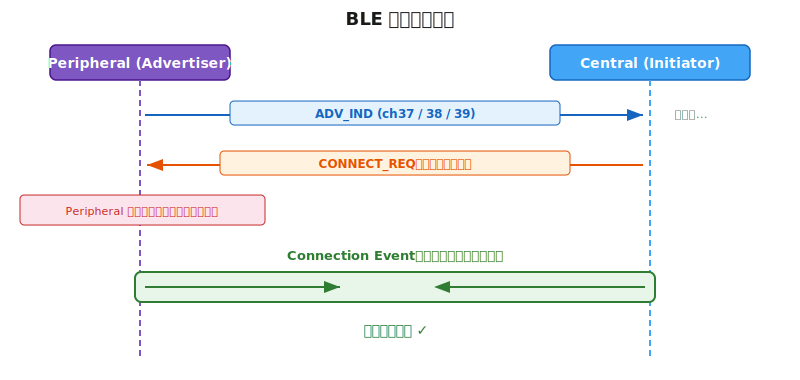

**CONNECT_REQ 关键字段：**

| 字段 | 说明 |
|------|------|
| Access Address | 32 位随机值，唯一标识本次连接（广播固定用 0x8E89BED6） |
| CRC Init | 本次连接的 CRC 计算初始值 |
| Win Size | 首个连接事件的接收窗口大小（× 1.25 ms） |
| Win Offset | 首个连接事件相对 CONNECT_REQ 的时间偏移（× 1.25 ms） |
| Interval | 连接间隔（× 1.25 ms） |
| Latency | 从机延迟（允许 Slave 跳过的连接事件数） |
| Timeout | 监督超时（× 10 ms） |
| ChM | 信道映射，37 bit 标记哪些数据信道可用 |
| Hop | 跳频步长（5–16） |
| SCA | 时钟精度等级 |

### 7.2 连接参数

#### 连接间隔（Connection Interval）

- 范围：**7.5 ms – 4 s**（步进 1.25 ms）
- 每个连接间隔称为一个**连接事件（Connection Event）**
- 每个连接事件内 Master 先发包，Slave 应答；至少完成一次数据交换

#### 从机延迟（Slave Latency）

- 范围：0 – 499
- 允许 Slave 在无数据发送时跳过指定数量的连续连接事件，不必每次都醒来
- 可大幅降低 Peripheral 端功耗

#### 监督超时（Supervision Timeout）

- 范围：**100 ms – 32 s**（步进 10 ms）
- 超时时间内未收到对方任何有效数据包，则判定连接丢失

**三参数约束关系（规范强制要求）：**

```
Supervision Timeout > (Slave Latency + 1) × Connection Interval × 2
```

示例验证：

```
Interval = 50 ms, Slave Latency = 4, Timeout = 6000 ms

(4 + 1) × 50 ms × 2 = 500 ms
6000 ms > 500 ms  ✓
```

### 7.3 连接参数更新

连接建立后，双方可通过以下三种方式更新参数：

| 方法 | 发起方 | 说明 |
|------|--------|------|
| LL_CONNECTION_UPDATE_IND | 仅 Master | 链路层直接更新，Slave 只能接受 |
| L2CAP Connection Parameter Update Request | Slave 发起，Master 决定 | 用于 BLE 4.0/4.1，Master 可拒绝 |
| PPCP Characteristic（GATT） | Peripheral 写入推荐值 | 仅是建议，Central 不一定遵从 |

### 7.4 MTU 协商

- 默认 ATT_MTU = **23 bytes**，有效 Payload = 20 bytes（去掉 3 字节 ATT 操作码 + 句柄）
- 连接建立后可通过 `ATT_EXCHANGE_MTU_REQ / RSP` 协商更大 MTU
- 双方各自申报支持的最大值，实际生效值取二者较小值
- BLE 4.2 引入 Data Length Extension（DLE），LL PDU Payload 最大可扩展至 251 字节

---

## 8. L2CAP

L2CAP（逻辑链路控制与适配协议）位于 LL 和 ATT/SMP 之间，提供：

- **信道复用**：ATT、SMP 等上层协议通过不同 CID（Channel ID）共用同一 LL 连接
  - ATT 固定 CID = 0x0004
  - SMP 固定 CID = 0x0006
  - LE L2CAP CoC（Connection-Oriented Channels）用于大数据流传输
- **数据分段与重组**：将上层 SDU 拆分为 LL PDU 大小的分段，或将多个 PDU 重组为 SDU
- **流量控制**（CoC 模式下）：基于信用（Credit）机制防止接收方溢出

---

## 9. ATT 属性协议

### 9.1 基本模型

ATT 采用 **Client / Server** 模型：
- **ATT Server**：维护一张属性表（Attribute Table），每个属性有句柄（Handle）、类型（UUID）、值（Value）和权限
- **ATT Client**：通过 Handle 或 UUID 对 Server 的属性执行读写操作

### 9.2 操作类型

| 操作 | 发起方 | 是否有响应 | 说明 |
|------|--------|-----------|------|
| Read Request / Response | Client | ✓ | 按 Handle 读取单个属性值 |
| Read By Type Req / Rsp | Client | ✓ | 按 UUID 批量读取同类属性 |
| Read By Group Type | Client | ✓ | 读取成组属性（用于 Service 发现） |
| Write Request / Response | Client | ✓ | 写入并等待 Server 确认 |
| Write Command | Client | ✗ | 写入无需确认（Write Without Response） |
| Find Information Req / Rsp | Client | ✓ | 获取 Handle → UUID 映射（Descriptor 发现） |
| Handle Value Notification | Server | ✗ | Server 主动推送，Client 无需回复 |
| Handle Value Indication | Server | ✓ | Server 主动推送，Client 须回复 Confirmation |

**Notify 与 Indicate 对比：**

| | Notify | Indicate |
|-|--------|---------|
| 可靠性 | 低（无 ACK） | 高（有 ATT_HANDLE_VALUE_CFM） |
| 速度/吞吐 | 快 | 慢（需等待确认后才能发下一条） |
| 适用场景 | 高频传感器数据 | 关键状态变化（门锁、报警） |

---

## 10. GATT 通用属性配置文件

### 10.1 数据层级

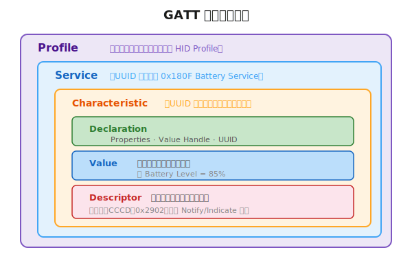

- **Profile**：描述完整应用场景的规范集合（如 HID Profile、Health Thermometer Profile）
- **Service**：相关 Characteristic 的逻辑分组，分 Primary Service 和 Secondary Service
- **Characteristic**：BLE 数据交互的最小单元，拥有 Properties（权限）、Value 和可选 Descriptor
- **Descriptor**：附属于 Characteristic 的元数据，最常用的是 CCCD（0x2902）

### 10.2 UUID

| 类型 | 长度 | 示例 | 适用 |
|------|------|------|------|
| 16-bit UUID | 2 字节 | `0x180F` | SIG 标准定义的 Service/Characteristic |
| 128-bit UUID | 16 字节 | `XXXXXXXX-XXXX-XXXX-XXXX-XXXXXXXXXXXX` | 自定义 Service/Characteristic |

16-bit UUID 是 128-bit 蓝牙基础 UUID 的缩写形式：

```
完整 UUID = 0000XXXX-0000-1000-8000-00805F9B34FB
```

**常用标准 UUID：**

| UUID | 名称 |
|------|------|
| 0x1800 | Generic Access Service |
| 0x1801 | Generic Attribute Service |
| 0x180F | Battery Service |
| 0x2A00 | Device Name Characteristic |
| 0x2A01 | Appearance Characteristic |
| 0x2A19 | Battery Level Characteristic |
| 0x2901 | Characteristic User Description Descriptor |
| 0x2902 | Client Characteristic Configuration Descriptor (CCCD) |
| 0x2803 | Characteristic Declaration |
| 0x2800 | Primary Service Declaration |

### 10.3 Characteristic Properties

Properties 字段为 1 字节，每个 bit 代表一种操作权限：

| Bit | 名称 | 说明 |
|-----|------|------|
| 0 | Broadcast | 可广播 Characteristic Value |
| 1 | Read | Client 可读取 Value |
| 2 | Write Without Response | Client 可无响应写入 |
| 3 | Write | Client 可带响应写入 |
| 4 | Notify | Server 可主动推送（需 CCCD 使能） |
| 5 | Indicate | Server 可主动指示（需 CCCD 使能，有 ACK） |
| 6 | Authenticated Signed Write | 带签名的写入 |
| 7 | Extended Properties | 扩展属性（见 Extended Properties Descriptor） |

### 10.4 CCCD（Client Characteristic Configuration Descriptor）

UUID：`0x2902`，每个支持 Notify/Indicate 的 Characteristic 都应有 CCCD。

| CCCD 值 | 含义 |
|---------|------|
| 0x0000 | 禁用 Notify 和 Indicate |
| 0x0001 | 使能 Notification |
| 0x0002 | 使能 Indication |

**订阅 Notification 流程：**

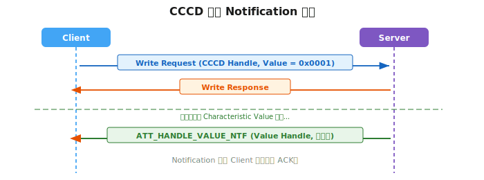

### 10.5 Service 发现流程

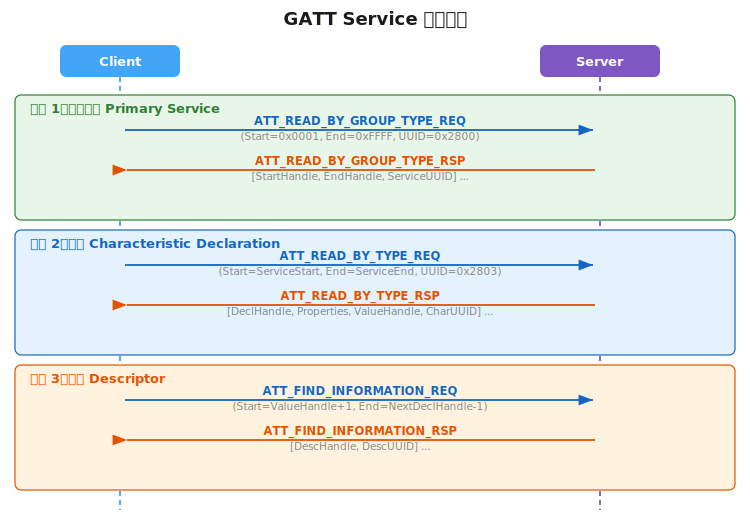

---

## 11. SMP 安全管理协议

### 11.1 配对与绑定

- **配对（Pairing）**：设备间协商并临时生成加密密钥（STK 或 LTK）的过程，断开后密钥默认丢失
- **绑定（Bonding）**：在配对后将 LTK 等密钥信息持久化存储（写入 Flash），下次连接可直接加密，无需重新配对

### 11.2 IO Capability 与配对方法

配对方法由双方的 IO Capability 共同决定：

| 发起方 IO 能力 | 响应方 IO 能力 | 配对方法 |
|----------------|----------------|----------|
| NoInput NoOutput | 任意 | Just Works（无 MITM 保护） |
| DisplayOnly | KeyboardOnly / KeyboardDisplay | Passkey Entry |
| DisplayYesNo | DisplayYesNo / KeyboardDisplay | Numeric Comparison（BLE 4.2+） |
| KeyboardOnly | DisplayOnly / DisplayYesNo | Passkey Entry |

- **Just Works**：无需用户交互，存在 MITM（中间人攻击）风险
- **Passkey Entry**：一方显示 6 位数字，另一方输入，防 MITM
- **Numeric Comparison**：双方各自显示同一数字，用户确认一致，防 MITM（LE Secure Connections）

### 11.3 配对流程（概览）

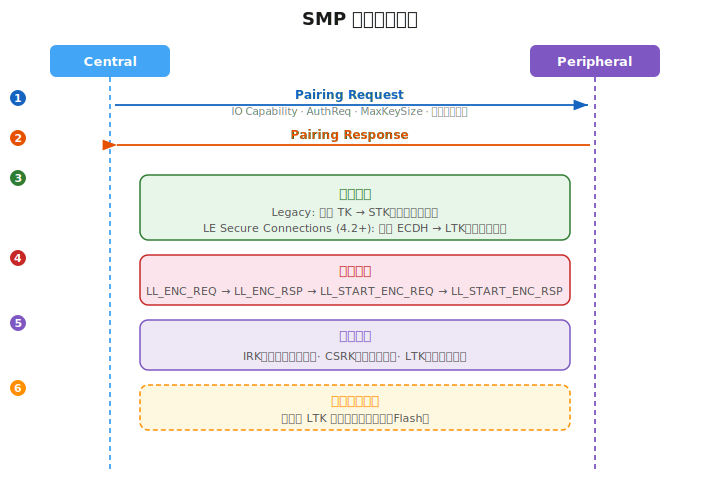

### 11.4 LE Secure Connections（BLE 4.2+）

- 使用 **ECDH（椭圆曲线 Diffie-Hellman）** 密钥协商
- 提供**前向保密性**：即使长期密钥泄露，历史会话数据也无法解密
- 防止被动窃听攻击（Legacy Pairing 无法抵抗）

---

## 12. 功耗优化

### 广播端功耗优化

| 策略 | 说明 |
|------|------|
| 按事件触发广播 | 平时不广播，仅有事件（按键、传感器触发）时激活 |
| 限时/限次广播 | 广播 N 次或持续 T 秒后自动停止 |
| 分阶段广播间隔 | 快速广播期（短间隔被发现）→ 慢速广播期（长间隔省电） |
| 减少 Payload 长度 | 缩短空中传输时间（Time on Air） |
| 使用 2M PHY | 相同数据量下传输时间减半（BLE 5.0+） |

### 连接端功耗优化

| 策略 | 说明 |
|------|------|
| 增大连接间隔 | 射频活跃时间变少，适合低频通信场景 |
| 使用从机延迟 | 无数据时 Slave 跳过连接事件，不必每次醒来 |
| 动态调整连接参数 | 有数据时切短间隔，空闲时切长间隔 |
| 减小发射功率 | 根据 RSSI 动态降低 TX Power |
| 数据合并发送 | 积累多条数据后批量发送，减少连接事件次数 |
| 扩大 MTU / 使用 DLE | 提高单次传输效率，减少总连接事件数 |

---

## 13. 应用场景：基于广播的遥控控制

### 场景特点

- 遥控器角色：**Broadcaster**，灯的角色：**Observer**
- 无需建立连接，单向通信，延迟极低
- 一个 Broadcaster 的广播可被多个 Observer 同时接收（一对多）

### 控制数据格式设计

使用 Manufacturer Specific Data 携带控制指令：

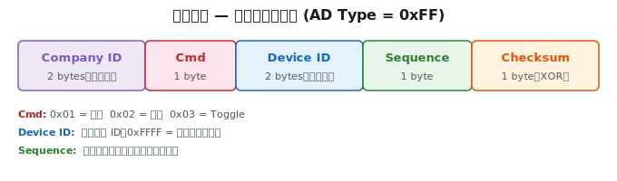

### 完整广播帧示例（关灯，目标所有设备，序号 5）

```
AD 1: 02 01 04
      Flags: LE General Discoverable, BR/EDR Not Supported

AD 2: 09 FF FF FF 02 FF FF 05 XOR
      Length=9
      AD Type=0xFF (Manufacturer Specific)
      Company ID=0xFFFF (测试)
      Cmd=0x02 (关灯)
      Device ID=0xFFFF (所有)
      Sequence=0x05
      Checksum=各字段异或值

总 Payload = 3 + 11 = 14 字节 ✓（< 31 字节上限）
```

### Observer 端处理逻辑（伪代码）

```c
void on_adv_report(adv_report_t *report) {
    ad_data_t *ad = find_ad_type(report->data, AD_TYPE_MFR_SPECIFIC);
    if (!ad) return;

    mfr_data_t *mfr = (mfr_data_t *)ad->data;
    if (mfr->company_id != MY_COMPANY_ID) return;
    if (!verify_checksum(mfr))             return;
    if (mfr->device_id != MY_ID && mfr->device_id != 0xFFFF) return;

    // 防重复：只处理比上次更新的序号
    if (mfr->sequence <= last_sequence)    return;
    last_sequence = mfr->sequence;

    switch (mfr->cmd) {
        case CMD_ON:     light_set(true);    break;
        case CMD_OFF:    light_set(false);   break;
        case CMD_TOGGLE: light_toggle();     break;
    }
}
```

### 可靠性优化方案

| 问题 | 解决方案 |
|------|----------|
| 广播无 ACK，不确定灯是否收到 | 遥控器重复发送同一命令 3–5 次 |
| Observer 可能收到同一包多次 | 加入递增序列号，Observer 去重 |
| 旧命令残留 | 添加时间戳或超时窗口，过期包丢弃 |
| 敏感控制被伪造 | 使用 AES-CCM 对 Payload 加密并附 MIC |

---

## 14. 应用场景：基于连接的 GATT 控制

### 场景特点

- Central（手机 APP）连接 Peripheral（智能灯），建立双向通信
- 支持读取状态、写入命令、订阅状态变化通知
- 适合需要双向确认、复杂交互的控制场景

### 自定义 GATT Service 设计（灯控）

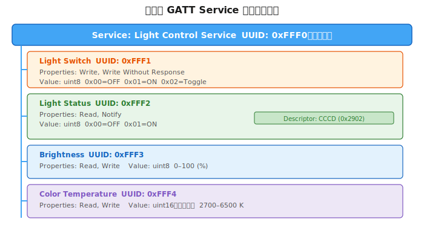

### 完整 GATT 交互时序

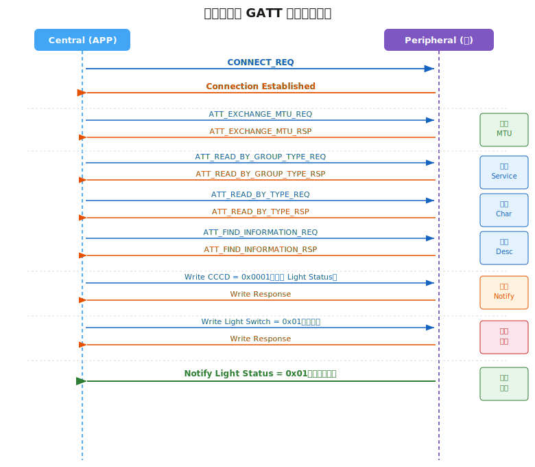

### 完整 GATT 表设计（含标准 Service）

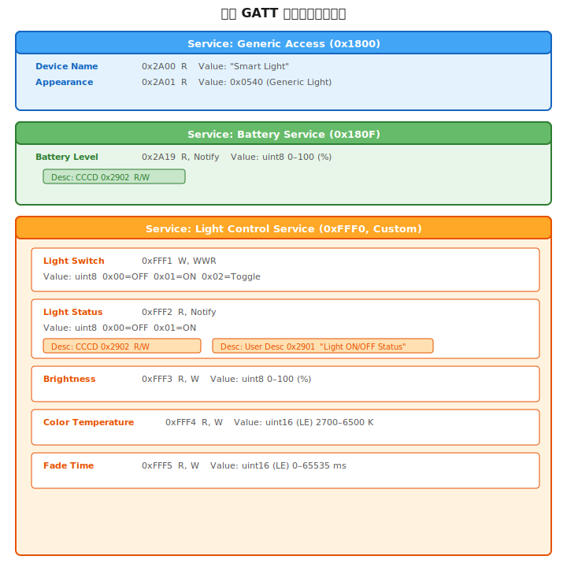

---

## 15. 习题解答

### Q1：BLE 协议栈由哪几层组成？各层主要功能是什么？

答：协议栈自底向上为：物理层（PHY）→ 链路层（LL）→ HCI（可选）→ L2CAP → SMP / ATT → GATT → GAP。各层功能详见第 2 章协议栈分层结构表格。

---

### Q2：GAP 定义了哪 4 种角色？各自的功能是什么？

答：
- **Broadcaster**：只发广播，不允许建立连接
- **Observer**：只扫描广播，不发起连接
- **Peripheral**：可被连接的广播设备（从机），广播可接受 CONNECT_REQ
- **Central**：主动扫描并向 Peripheral 发起连接（主机）

---

### Q3：BLE 链路层有哪几种状态？转换关系是什么？

答：共 5 种：Standby、Advertising、Scanning、Initiating、Connection。设备从 Standby 可进入任意活跃状态；Initiating 收到目标设备广播后发 CONNECT_REQ 并进入 Connection；Connection 断开后返回 Standby。

---

### Q4：BLE 与 BR/EDR 的主要区别是什么？

答：见第 1 章 BLE 概述对比表。核心区别：BLE 专为低占空比场景设计，μA 级休眠，连接延迟 < 6 ms；BR/EDR 面向高带宽持续连接（音频/文件），功耗更高。两者不互相兼容。

---

### Q5：BLE 为什么使用信道 37、38、39 作为广播信道？

答：三个信道频率（2402/2426/2480 MHz）刻意落在 Wi-Fi 2.4 GHz 信道 1（2412 MHz）、6（2437 MHz）、11（2462 MHz）的间隙或边缘，最大程度降低与 Wi-Fi 的同频干扰。

---

### Q6：ADV_IND 和 ADV_NONCONN_IND 有什么区别？

答：
- **ADV_IND**：可连接 + 可扫描，任意 Central 可向其发 CONNECT_REQ 建立连接，Scanner 可发 SCAN_REQ 获取额外数据，是最通用的广播类型
- **ADV_NONCONN_IND**：不可连接 + 不可扫描，设备仅单向播发数据，不响应任何请求，典型用于 Beacon

---

### Q7：如何解析广播包中的 AD Structure？

答：格式为 `[Length 1B][AD Type 1B][AD Data (Length-1)B]`，多个 AD Structure 紧排。解析示例见第 6.2 节。

---

### Q8：CONNECT_REQ 中连接间隔、从机延迟和监督超时有何约束？

答：规范要求：`Supervision Timeout > (Slave Latency + 1) × Connection Interval × 2`。确保 Slave 在利用最大延迟不应答时，Master 也不会在此期间误触发超时断连。

---

### Q9：BLE 跳频算法是什么？为什么要自适应？

答：使用 `next_channel = (current_channel + hop) mod 37`，若计算出的信道不可用则通过 remapping 映射到可用信道。自适应跳频的目的是动态规避受到干扰（如 Wi-Fi）的信道，Controller 可随时下发新信道映射表。

---

### Q10：ATT_MTU 是什么？如何修改？

答：ATT_MTU 是每个 ATT PDU 的最大字节数，默认 23 字节（有效 Payload 20 字节）。连接建立后通过 `ATT_EXCHANGE_MTU_REQ/RSP` 协商，双方取较小值生效。

---

### Q11：Notify 和 Indicate 的区别？各自适合什么场景？

答：
- **Notify**：无 ACK，速度快，可靠性低，适合高频采样数据（如温湿度、加速度）
- **Indicate**：Client 须回 Confirmation，可靠但慢，适合关键状态变化（门锁状态、报警）

---

### Q12：如何使能一个 Characteristic 的 Notification？

答：通过 Write Request 向该 Characteristic 的 CCCD（UUID 0x2902）写入值 `0x0001`，Server 确认后，当对应 Value 更新时会自动发 Notification。

---

### Q13：配对（Pairing）和绑定（Bonding）的区别？

答：
- **配对**：临时协商生成加密密钥，断开连接后密钥丢失
- **绑定**：在配对后将 LTK 等密钥持久写入存储，下次连接直接加密，无需重配对

---

### Q14：为什么广播遥控场景选择广播而非连接？

答：
- **一对多**：单次广播可同时到达多个 Observer，连接只能一对一
- **低延迟**：无连接建立开销，按键响应更快
- **低功耗**：发完即停，无需维持连接
- **无需配对**：任意 Observer 都能接收，无需预先握手

---

### Q15：实践——设计广播遥控完整数据帧

场景：Company ID = 0xFFFF，命令 = 关灯，Device ID = 0x0001，Sequence = 0x05

```
AD 1: 02 01 04
      Flags: LE General Discoverable | BR/EDR Not Supported

AD 2: 09 FF FF FF 02 01 00 05 [XOR]
      Length = 9
      AD Type = 0xFF (Manufacturer Specific)
      Company ID = FF FF  (小端, 0xFFFF)
      Cmd = 02  (关灯)
      Device ID = 01 00  (小端, 0x0001)
      Sequence = 05
      Checksum = FF^FF^02^01^00^05 = 0x?? (异或)

总 Payload = 3 + 11 = 14 字节 ✓
```

---

### Q16：实践——分析一个 CONNECT_REQ 包

```
WinSize  = 0x02 → 2 × 1.25 ms = 2.5 ms
WinOffset= 0x0004 → 4 × 1.25 ms = 5 ms
Interval = 0x0018 → 24 × 1.25 ms = 30 ms
Latency  = 0x0000 → Slave 延迟 = 0
Timeout  = 0x00C8 → 200 × 10 ms = 2000 ms
ChM      = FF FF FF FF 1F → 37 个信道全部可用
Hop      = 7 → 跳频步长 7

约束验证：Timeout(2000) > (0+1) × 30 × 2 = 60 ms  ✓
首个连接事件约在 CONNECT_REQ 后 5 + 30 = 35 ms 到达
跳频序列：ch0 → 7 → 14 → 21 → 28 → 35 → 5 → 12 → ...
```

---

## 16. 核心参数速查与常见问题排查

### 核心参数速查

| 参数 | 范围 / 值 | 步进 | 备注 |
|------|----------|------|------|
| 射频信道总数 | 40 | — | 3 广播 + 37 数据 |
| 信道带宽 | 2 MHz | — | |
| 广播信道 | 37/38/39 (2402/2426/2480 MHz) | — | |
| 最大广播 Payload | 31 bytes | — | SCAN_RSP 同样 31 字节 |
| 广播间隔 | 20 ms – 10.24 s | — | + 0–10 ms 随机抖动 |
| 连接间隔 | 7.5 ms – 4 s | 1.25 ms | |
| 从机延迟 | 0 – 499 | 1 | |
| 监督超时 | 100 ms – 32 s | 10 ms | |
| 跳频步长 | 5 – 16 | 1 | CONNECT_REQ 中指定 |
| 默认 ATT MTU | 23 bytes | — | 有效 Payload = 20 bytes |
| LL PDU Payload (BLE 4.x) | 最大 27 bytes | — | 不含 MIC |
| LL PDU Payload (BLE 5.x DLE) | 最大 251 bytes | — | Data Length Extension |
| 1M PHY 速率 | 1 Mbps | — | |
| 2M PHY 速率 | 2 Mbps | — | BLE 5.0+ |
| Coded PHY 速率 | 125 kbps / 500 kbps | — | BLE 5.0+，远距离 |

### 常见问题排查

| 现象 | 可能原因 | 排查方向 |
|------|----------|----------|
| 扫描不到设备 | 广播未启动 / 间隔过长 / 信道干扰 | 检查广播配置；缩短间隔；换频段测试 |
| 连接频繁断开 | 监督超时过短 / 信号弱 / 参数不满足约束 | 增大 Timeout；检查天线；验证三参数约束 |
| 连接响应延迟高 | 连接间隔过大 | 减小 Connection Interval |
| Notify 收不到 | CCCD 未使能 / 连接未加密 / Server 未触发 | 确认 CCCD 写入成功；检查加密状态 |
| Write 失败（错误码） | 权限不足 / ATT_ERR_WRITE_NOT_PERMITTED | 检查 Characteristic Properties 和 ATT 权限 |
| Write 数据被截断 | 数据长度超过 MTU - 3 | 协商更大 MTU 或启用 DLE |
| 配对失败 | IO Capability 不匹配 / 密钥不同步 | 清除双方绑定信息后重新配对 |
| 广播命令重复执行 | Observer 收到多次同一广播包 | 检查序列号去重逻辑 |

---

## 参考资料下载

本文整理自《BLE基础培训框架》，结合以下蓝牙官方规范文档。点击下载：

| 文档 | 说明 |
|------|------|
| [Bluetooth Core Specification v4.2](/viys/docs/Core_v4.2.pdf) | 蓝牙核心规范完整版，涵盖物理层、链路层、L2CAP、ATT、GATT、SMP 等所有协议 |
| [Core Specification Supplement v12](/viys/docs/CSS_v12.pdf) | 核心规范补充文档，定义广播数据类型（AD Type）、EIR 格式等 |
| [GATT Specification Supplement](/viys/docs/GATT_Specification_Supplement.pdf) | GATT 规范补充，定义标准特征值的数据格式与解析规则 |
