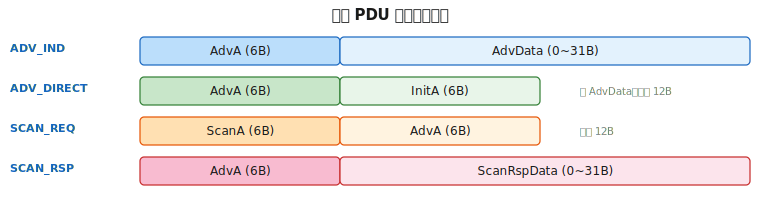
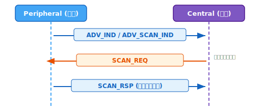
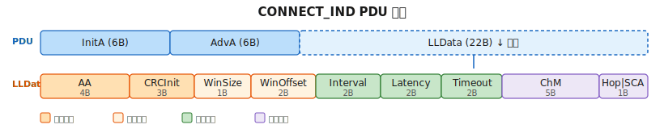
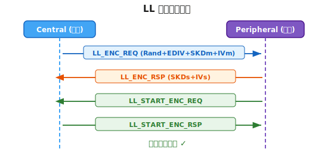
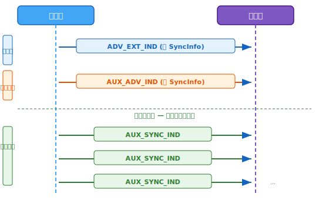
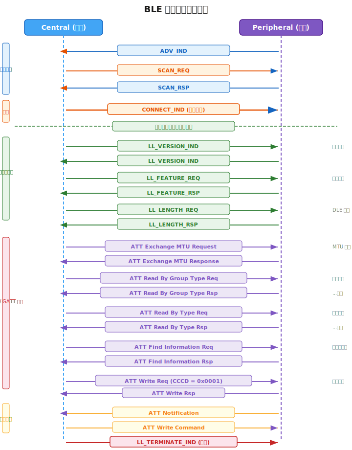

# BLE 抓包数据解析

> 系统性解析 BLE 通信中各类数据包的结构与字段含义，覆盖从广播到数据交换的完整流程。

---

## BLE 数据包格式概览

BLE 数据包分为 4 层，从外到内依次嵌套：


| 层 | 字段 | 大小 | 说明 |
|----|------|------|------|
| Physical | Preamble | 1B | 前导码，无线同步用，nRF Sniffer **不捕获** |
| Physical | Access Address | 4B | 广播固定 `0x8E89BED6`，连接后协商 |
| Physical | CRC | 3B | 循环冗余校验 |
| LL | LL Header | 2B | PDU 类型、地址类型、长度 |
| LL | MIC | 4B | 消息完整性校验（加密时存在） |
| L2CAP | Header | 4B | Length(2B) + CID(2B) |
| ATT | Header | 3B | OP Code(1B) + Attribute Handle(2B) |
| ATT | Payload | max 244B | 实际交互数据 |

> **注意**：nRF Sniffer 会在每个数据包前添加 **17 字节私有头部**（含 RSSI、信道等元数据），不属于 BLE 协议内容。

### LL Header 位字段定义

广播包和数据包的 LL Header 结构不同：

**广播包 LL Header（2 字节）：**

| 位 | 字段 | 说明 |
|----|------|------|
| [3:0] | PDU Type | 广播 PDU 类型（见下表） |
| [4] | RFU | 保留 |
| [5] | ChSel | Channel Selection Algorithm 支持 |
| [6] | TxAdd | 发送方地址类型：0=Public, 1=Random |
| [7] | RxAdd | 接收方地址类型：0=Public, 1=Random |
| [15:8] | Length | PDU 负载长度（6~37 字节） |

**数据包 LL Header（2 字节）：**

| 位 | 字段 | 说明 |
|----|------|------|
| [1:0] | LLID | 00=保留, 01=L2CAP续包/空包, 10=L2CAP首包, 11=LL Control |
| [2] | NESN | Next Expected Sequence Number |
| [3] | SN | Sequence Number |
| [4] | MD | More Data，1=还有后续包 |
| [7:5] | RFU | 保留 |
| [15:8] | Length | 负载长度 |

**广播 PDU Type 速查表：**

| PDU Type | 值 | 方向 | 可连接 | 可扫描 |
|----------|-----|------|--------|--------|
| ADV_IND | 0000 | Adv→ | ✓ | ✓ |
| ADV_DIRECT_IND | 0001 | Adv→ | ✓ | ✗ |
| ADV_NONCONN_IND | 0010 | Adv→ | ✗ | ✗ |
| SCAN_REQ | 0011 | Scan→Adv | — | — |
| SCAN_RSP | 0100 | Adv→Scan | — | — |
| CONNECT_IND | 0101 | Init→Adv | — | — |
| ADV_SCAN_IND | 0110 | Adv→ | ✗ | ✓ |

---

## 广播阶段数据包

### ADV_IND — 可连接无向广播

ADV_IND 是最常见的广播类型，设备向所有方向广播，允许任何主机发起扫描或连接。

**PDU 结构：**



**示例解析：**

```
Access Address:  d6 be 89 8e → 0x8E89BED6（广播固定值）
LL Header:       00 19
AdvA:            11 22 33 44 55 66 → 66:55:44:33:22:11（小端序）
AD: Flags:       02 01 06
AD: Device Name: 0b 09 "My_BLE_Dev"
CRC:             xx xx xx
```

**LL Header 解析（`00 19`）：**

| 字段 | 值 | 含义 |
|------|-----|------|
| PDU Type | `0000b` | ADV_IND，可连接无向广播 |
| ChSel | `0` | Channel Selection Algorithm #1 |
| TxAdd | `0` | 广播地址类型 = Public |
| Length | `0x19 = 25` | PDU 负载 25 字节 |

**Advertising Data 结构：**

AD 统一格式：`Length(1B) | Type(1B) | Value`

| AD 字段 | 原始字节 | 解析 |
|---------|---------|------|
| Flags | `02 01 06` | Length=2, Type=Flags, Value=0x06 → LE General Discoverable + BR/EDR Not Supported |
| Complete Local Name | `0b 09 4d 79 5f 42 4c 45 5f 44 65 76` | Length=11, Type=0x09, Value="My_BLE_Dev" |

> **要点**：ADV_IND 在 37/38/39 三个广播信道上循环发送，间隔由广播间隔参数决定（典型值 100ms~1s）。

---

### ADV_DIRECT_IND — 定向广播

定向广播只针对特定主机，不携带额外广播数据，常用于快速重连场景。

**PDU 结构：** 见上方广播 PDU 结构一览图（ADV_DIRECT 行）。

**示例解析：**

```
LL Header:  21 0c
AdvA:       11 22 33 44 55 66 → 66:55:44:33:22:11（广播方）
InitA:      aa bb cc dd ee ff → ff:ee:dd:cc:bb:aa（目标主机）
```

| 字段 | 值 | 含义 |
|------|-----|------|
| PDU Type | `0001b` | ADV_DIRECT_IND |
| TxAdd | `0` | 广播方 Public 地址 |
| RxAdd | `1` | 目标方 Random 地址 |
| Length | `0x0c = 12` | AdvA(6B) + InitA(6B) = 12 |

> **要点**：定向广播**不携带 AdvData**，PDU 负载固定 12 字节。高占空比模式下广播间隔 ≤ 3.75ms，持续时间不超过 1.28s。

---

### ADV_NONCONN_IND — 不可连接广播

设备仅广播数据，不接受连接和扫描请求。典型应用：iBeacon、温度传感器定时广播。

**PDU 结构：** 见上方广播 PDU 结构一览图（ADV_IND 行，结构相同）。

**示例解析：**

```
LL Header:  02 17
AdvA:       11 22 33 44 55 66 → 66:55:44:33:22:11
AdvData:    02 01 04  → Flags: LE Limited Discoverable
            0a ff 4c 00 02 15 ...  → Manufacturer Specific Data (iBeacon)
```

| 字段 | 值 | 含义 |
|------|-----|------|
| PDU Type | `0010b` | ADV_NONCONN_IND |
| TxAdd | `0` | Public 地址 |
| Length | `0x17 = 23` | PDU 负载 23 字节 |

> **要点**：不可连接广播的 Flags 通常设置 `0x04`（BR/EDR Not Supported），不设 General/Limited Discoverable 位。

---

### SCAN_REQ — 扫描请求

主机在主动扫描模式下，向广播设备请求更多信息。

**PDU 结构：** 见上方广播 PDU 结构一览图（SCAN_REQ 行）。

**示例解析：**

```
LL Header:  43 0c
ScanA:      77 88 99 aa bb cc → cc:bb:aa:99:88:77（扫描方，Random 地址）
AdvA:       11 22 33 44 55 66 → 66:55:44:33:22:11（被扫描方）
```

| 字段 | 值 | 含义 |
|------|-----|------|
| PDU Type | `0011b` | SCAN_REQ |
| TxAdd | `1` | 扫描方地址 = Random（隐私保护） |
| RxAdd | `0` | 被扫描方地址 = Public |
| Length | `0x0c = 12` | ScanA(6B) + AdvA(6B) = 12 |

**扫描流程：**



> **要点**：SCAN_REQ 只在主动扫描模式下产生，被动扫描不发此包。扫描方常使用 Random 地址防止被追踪。

---

### SCAN_RSP — 扫描响应

设备收到 SCAN_REQ 后回复的额外广播数据，可携带主广播包放不下的信息。

**PDU 结构：** 见上方广播 PDU 结构一览图（SCAN_RSP 行）。

**示例解析：**

```
LL Header:  04 15
AdvA:       11 22 33 44 55 66 → 66:55:44:33:22:11
ScanRspData:
  07 ff 59 00 01 02 03 04     → Manufacturer Specific Data
  08 16 0a 18 64 00 c8 00 01  → Service Data (Battery: 100%, Temperature)
```

| 字段 | 值 | 含义 |
|------|-----|------|
| PDU Type | `0100b` | SCAN_RSP |
| TxAdd | `0` | 响应方 Public 地址 |
| Length | `0x15 = 21` | AdvA(6B) + ScanRspData(15B) = 21 |

> **要点**：SCAN_RSP 的 AdvData 格式与 ADV_IND 的 AdvData 相同，都遵循 AD Structure 格式。主广播 + 扫描响应合计最多可携带 62 字节广播数据。

---

## 连接建立数据包

### CONNECT_IND — 连接请求

主机向广播设备发送连接请求，包含所有连接参数。这是 BLE 连接建立的关键包。

**PDU 结构：**



**示例解析：**

```
LL Header:  45 22
InitA:      77 88 99 aa bb cc → cc:bb:aa:99:88:77（发起方）
AdvA:       11 22 33 44 55 66 → 66:55:44:33:22:11（广播方）
LLData:
  a1 b2 c3 d4              → Access Address = 0xD4C3B2A1
  e5 f6 07                  → CRCInit = 0x07F6E5
  02                        → WinSize = 2
  06 00                     → WinOffset = 6
  18 00                     → Interval = 24
  00 00                     → Latency = 0
  c8 00                     → Timeout = 200
  ff ff ff ff 1f            → ChM = 0x1FFFFFFFFF (all 37 channels)
  a7                        → Hop = 7, SCA = 5
```

| 字段 | 值 | 含义 |
|------|-----|------|
| PDU Type | `0101b` | CONNECT_IND |
| TxAdd | `1` | 发起方 Random 地址 |
| RxAdd | `0` | 广播方 Public 地址 |
| Length | `0x22 = 34` | InitA(6B) + AdvA(6B) + LLData(22B) = 34 |

**LLData 各字段详解：**

| 字段 | 字节 | 值 | 换算 | 说明 |
|------|------|-----|------|------|
| Access Address | 4B | `0xD4C3B2A1` | — | 连接后所有数据包使用此地址（取代广播 AA） |
| CRCInit | 3B | `0x07F6E5` | — | CRC 计算初始值 |
| WinSize | 1B | `2` | 2 × 1.25ms = 2.5ms | 连接第一包的接收窗口大小 |
| WinOffset | 2B | `6` | 6 × 1.25ms = 7.5ms | 从 CONNECT_IND 结束到第一个连接窗口的偏移 |
| Interval | 2B | `24` | 24 × 1.25ms = **30ms** | 连接间隔（两次连接事件间的时间） |
| Latency | 2B | `0` | 0 个事件 | 从机可跳过的连接事件数（0=每次都必须响应） |
| Timeout | 2B | `200` | 200 × 10ms = **2000ms** | 连接超时，超过此时间未收到包则断开 |
| ChM | 5B | `0x1FFFFFFFFF` | 37 位全 1 | 信道映射，每位代表一个数据信道（1=使用） |
| Hop | 5bit | `7` | — | 跳频增量（1~16） |
| SCA | 3bit | `5` | — | 主机睡眠时钟精度（0~7，值越大精度越高） |

**连接参数约束关系：**

```
Timeout > (1 + Latency) × Interval × 2
  2000ms > (1 + 0) × 30ms × 2 = 60ms  ✓
```

> **要点**：CONNECT_IND 之后，双方切换到协商的 Access Address 和数据信道通信，广播阶段结束。

---

## 链路层控制数据包

链路层控制 PDU（LLID=`11b`）用于连接参数协商和链路管理。


### LL_VERSION_IND — 版本交换

连接后双方交换 BLE 版本信息，通常由主机先发起，从机必须回复。

**Opcode**: `0x0C`

```
LL Header:  03 06 (LLID=11, Length=6)
Opcode:     0c
VersNr:     09          → BLE 5.0 (Core Spec Version)
CompId:     0d 00       → Company ID = 0x000D (Texas Instruments)
SubVersNr:  00 00       → Sub-version = 0x0000
```

| 字段 | 大小 | 说明 |
|------|------|------|
| VersNr | 1B | BLE 版本号：06=4.0, 07=4.1, 08=4.2, 09=5.0, 0a=5.1, 0b=5.2, 0c=5.3, 0d=5.4, 0e=6.0 |
| CompId | 2B | Bluetooth SIG 分配的公司标识符 |
| SubVersNr | 2B | 厂商自定义子版本号 |

> **要点**：版本交换是单向的 — 双方各发一次 `LL_VERSION_IND`，不存在 REQ/RSP 之分。主机通常先发。

---

### LL_FEATURE_REQ / LL_FEATURE_RSP — 功能交换

主机查询从机支持的 LL 功能特性。

**Opcode**: REQ=`0x08`, RSP=`0x09`

```
LL Header:  03 09 (LLID=11, Length=9)
Opcode:     08 (LL_FEATURE_REQ)
FeatureSet: ff ff 0f 00 00 00 00 00  (8B)
```

**FeatureSet 位定义（常见位）：**

| 位 | 功能 | 说明 |
|----|------|------|
| 0 | LE Encryption | 支持链路层加密 |
| 1 | Connection Parameters Request | 从机可请求连接参数更新 |
| 2 | Extended Reject Indication | 扩展拒绝指示 |
| 3 | Slave-initiated Features Exchange | 从机可发起功能交换 |
| 4 | LE Ping | LE Ping 支持 |
| 5 | LE Data Packet Length Extension | 数据包长度扩展（DLE）|
| 6 | LL Privacy | 链路层隐私 |
| 7 | Extended Scanner Filter Policies | 扩展扫描过滤策略 |
| 8 | LE 2M PHY | 2 Mbps PHY 支持 |
| 9 | Stable Modulation Index - TX | 稳定调制索引（发送） |
| 10 | Stable Modulation Index - RX | 稳定调制索引（接收） |
| 11 | LE Coded PHY | 远距离编码 PHY 支持 |

> **要点**：最终使用的功能集是双方 FeatureSet 的**按位与（AND）**，即只启用双方都支持的功能。

---

### LL_LENGTH_REQ / LL_LENGTH_RSP — 数据长度更新（DLE）

协商链路层最大数据包长度和传输时间（BLE 4.2+ 功能）。

**Opcode**: REQ=`0x14`, RSP=`0x15`

```
LL Header:  03 09 (LLID=11, Length=9)
Opcode:     14 (LL_LENGTH_REQ)
MaxRxOctets:  fb 00    → 251 字节
MaxRxTime:    48 08    → 2120 μs
MaxTxOctets:  fb 00    → 251 字节
MaxTxTime:    48 08    → 2120 μs
```

| 字段 | 大小 | 范围 | 说明 |
|------|------|------|------|
| MaxRxOctets | 2B | 27~251 | 本端最大接收负载字节数 |
| MaxRxTime | 2B | 328~17040 μs | 本端最大接收时间 |
| MaxTxOctets | 2B | 27~251 | 本端最大发送负载字节数 |
| MaxTxTime | 2B | 328~17040 μs | 本端最大发送时间 |

**DLE 前后对比：**

| 参数 | 默认值 | DLE 后典型值 |
|------|--------|-------------|
| 最大负载 | 27B | 251B |
| 传输时间 | 328μs | 2120μs |
| 吞吐量 | ~800 bps | ~800 kbps（提升约 10 倍）|

> **要点**：DLE 是提升 BLE 吞吐量的关键手段。实际使用的长度取双方 Max 值的**较小值**。

---

### LL_CHANNEL_MAP_IND — 信道图更新

主机通知从机更新数据信道映射表，用于避开受干扰的信道。

**Opcode**: `0x01`

```
LL Header:  03 08 (LLID=11, Length=8)
Opcode:     01
ChM:        ff ff ff ff 1f    → 5B, 37 位 (channel 0~36)
Instant:    2c 00             → 在连接事件计数 = 44 时生效
```

| 字段 | 大小 | 说明 |
|------|------|------|
| ChM | 5B | 新的信道映射，bit=1 表示该信道可用 |
| Instant | 2B | 新映射生效的连接事件编号 |

**ChM 示例：**

```
ff ff ff ff 1f = 全部 37 个数据信道可用
ff ff f7 ff 1f = channel 19 被禁用（干扰信道）
```

> **要点**：只有主机可以发送信道图更新。从机若发现某信道质量差，需通过其他机制通知主机。

---

### LL_CONNECTION_UPDATE_IND — 连接参数更新

主机在不断开连接的情况下更新连接参数。

**Opcode**: `0x00`

```
LL Header:  03 0c (LLID=11, Length=12)
Opcode:     00
WinSize:    01              → 1 × 1.25ms = 1.25ms
WinOffset:  00 00           → 0ms
Interval:   24 00           → 36 × 1.25ms = 45ms
Latency:    00 00           → 0
Timeout:    c8 00           → 200 × 10ms = 2000ms
Instant:    64 00           → 在连接事件计数 = 100 时生效
```

| 字段 | 大小 | 说明 |
|------|------|------|
| WinSize | 1B | 新参数生效后首个锚点的接收窗口 |
| WinOffset | 2B | 锚点偏移 |
| Interval | 2B | 新连接间隔（× 1.25ms） |
| Latency | 2B | 新从机延迟 |
| Timeout | 2B | 新连接超时（× 10ms） |
| Instant | 2B | 新参数生效的连接事件编号 |

> **要点**：参数更新在 `Instant` 指定的事件编号**瞬间切换**，双方必须同时采用新参数。在 Instant 之前的事件仍使用旧参数。

---

### LL_TERMINATE_IND — 断开连接

任一方均可发起连接终止。

**Opcode**: `0x02`

```
LL Header:  03 02 (LLID=11, Length=2)
Opcode:     02
ErrorCode:  13    → Remote User Terminated Connection
```

**常见 ErrorCode：**

| 错误码 | 含义 |
|--------|------|
| `0x13` | Remote User Terminated Connection（对端主动断开） |
| `0x16` | Connection Terminated by Local Host（本地主动断开） |
| `0x08` | Connection Timeout（连接超时） |
| `0x22` | LMP Response Timeout / LL Response Timeout |
| `0x3B` | Connection Failed to be Established |

> **要点**：发送 LL_TERMINATE_IND 后，发送方需等到确认对方收到（ACK）后才真正关闭连接。

---

## L2CAP / ATT 层数据包

连接建立后，上层协议数据通过 L2CAP 封装传输。ATT（Attribute Protocol）承载 GATT 操作。

**L2CAP 包格式：**


常见 CID 值：

| CID | 协议 |
|-----|------|
| `0x0004` | ATT（Attribute Protocol） |
| `0x0005` | LE Signaling Channel |
| `0x0006` | SMP（Security Manager Protocol） |

### ATT Exchange MTU — MTU 协商

客户端（主机）通知服务端自己支持的最大 ATT PDU 大小，服务端回复自己的。

**Request（Opcode `0x02`）：**

```
LL Header:  06 07 (LLID=10, Length=7)
L2CAP:      03 00 04 00    → L2CAP Length=3, CID=0x0004 (ATT)
ATT:        02 00 02       → Opcode=Exchange MTU Request, Client Rx MTU=512
```

**Response（Opcode `0x03`）：**

```
ATT:        03 17 00       → Opcode=Exchange MTU Response, Server Rx MTU=23
```

| 字段 | 说明 |
|------|------|
| Client Rx MTU | 客户端能接收的最大 ATT PDU 字节数 |
| Server Rx MTU | 服务端能接收的最大 ATT PDU 字节数 |
| 生效 MTU | min(Client Rx MTU, Server Rx MTU) |

> **要点**：BLE 默认 MTU=23（ATT payload 最大 20 字节）。协商更大 MTU 可减少分包次数，提升效率。

---

### ATT Read By Group Type — 服务发现

客户端发现服务端的所有 Primary Service 或 Secondary Service。

**Request（Opcode `0x10`）：**

```
ATT:  10 01 00 ff ff 00 28
      │  │     │     │
      │  │     │     └─ UUID = 0x2800 (Primary Service)
      │  │     └─ End Handle = 0xFFFF
      │  └─ Start Handle = 0x0001
      └─ Opcode = Read By Group Type Request
```

**Response（Opcode `0x11`）：**

```
ATT:  11 06 01 00 05 00 00 18 06 00 09 00 01 18 0a 00 0f 00 0a 18
      │  │  │─────────────│  │─────────────│  │─────────────│
      │  │  Service 1      Service 2        Service 3
      │  └─ Length = 6 (每组 6 字节: StartHandle + EndHandle + UUID)
      └─ Opcode = Read By Group Type Response
```

解析每组服务：

| Start Handle | End Handle | UUID | 服务名 |
|-------------|------------|------|--------|
| `0x0001` | `0x0005` | `0x1800` | Generic Access |
| `0x0006` | `0x0009` | `0x1801` | Generic Attribute |
| `0x000A` | `0x000F` | `0x180A` | Device Information |

> **要点**：当搜索完所有服务后，服务端回复 **Error Response**（Opcode `0x01`）并带有错误码 `0x0A`（Attribute Not Found），表示搜索结束。

---

### ATT Read By Type — 特征发现

在已知服务句柄范围内，发现该服务包含的所有特征。

**Request（Opcode `0x08`）：**

```
ATT:  08 0a 00 0f 00 03 28
      │  │     │     │
      │  │     │     └─ UUID = 0x2803 (Characteristic Declaration)
      │  │     └─ End Handle = 0x000F
      │  └─ Start Handle = 0x000A
      └─ Opcode = Read By Type Request
```

**Response（Opcode `0x09`）：**

```
ATT:  09 07 0b 00 02 0c 00 29 2a
      │  │  │     │  │     │
      │  │  │     │  │     └─ Characteristic UUID = 0x2A29 (Manufacturer Name)
      │  │  │     │  └─ Value Handle = 0x000C
      │  │  │     └─ Properties = 0x02 (Read)
      │  │  └─ Declaration Handle = 0x000B
      │  └─ Length = 7
      └─ Opcode = Read By Type Response
```

**Characteristic Properties 位定义：**

| 位 | 属性 | 说明 |
|----|------|------|
| 0 | Broadcast | 允许广播特征值 |
| 1 | Read | 允许读取 |
| 2 | Write Without Response | 允许无响应写入 |
| 3 | Write | 允许写入（带响应） |
| 4 | Notify | 允许通知 |
| 5 | Indicate | 允许指示（需确认） |
| 6 | Authenticated Signed Writes | 签名写入 |
| 7 | Extended Properties | 有扩展属性描述符 |

> **要点**：特征发现同样以 Error Response（`0x0A` Attribute Not Found）结束。Properties 字段决定了该特征支持哪些操作。

---

### ATT Find Information — 描述符发现

在特征值句柄之后、下一个特征声明之前查找描述符（如 CCCD）。

**Request（Opcode `0x04`）：**

```
ATT:  04 0d 00 0f 00
      │  │     │
      │  │     └─ End Handle = 0x000F
      │  └─ Start Handle = 0x000D
      └─ Opcode = Find Information Request
```

**Response（Opcode `0x05`）：**

```
ATT:  05 01 0d 00 02 29
      │  │  │     │
      │  │  │     └─ UUID = 0x2902 (CCCD)
      │  │  └─ Handle = 0x000D
      │  └─ Format = 0x01 (16-bit UUIDs)
      └─ Opcode = Find Information Response
```

**常见描述符 UUID：**

| UUID | 名称 | 用途 |
|------|------|------|
| `0x2900` | Characteristic Extended Properties | 扩展属性 |
| `0x2901` | Characteristic User Description | 用户可读描述 |
| `0x2902` | Client Characteristic Configuration (CCCD) | 启用 Notify/Indicate |
| `0x2903` | Server Characteristic Configuration | 服务端配置 |

> **要点**：CCCD（`0x2902`）是最常用的描述符。向 CCCD 写入 `01 00` 启用通知，写入 `02 00` 启用指示，写入 `00 00` 关闭。

---

### ATT Write Request / Response — 写入（带确认）

客户端写入特征值或描述符，服务端确认。

**Write Request（Opcode `0x12`）：**

```
ATT:  12 0d 00 01 00
      │  │     │
      │  │     └─ Value = 0x0001 (启用 Notify)
      │  └─ Handle = 0x000D (CCCD)
      └─ Opcode = Write Request
```

**Write Response（Opcode `0x13`）：**

```
ATT:  13
      └─ Opcode = Write Response (无负载，仅确认)
```

> **要点**：Write Request 必须等到 Write Response 后才能发送下一个请求。如果 30 秒未收到响应，连接可能超时。

---

### ATT Write Command — 无响应写入

客户端写入特征值，不需要服务端确认。适合高频率数据传输。

**Write Command（Opcode `0x52`）：**

```
ATT:  52 10 00 48 65 6c 6c 6f
      │  │     │
      │  │     └─ Value = "Hello" (ASCII)
      │  └─ Handle = 0x0010
      └─ Opcode = Write Command
```

> **要点**：Write Command 不占用 ATT 事务，可以连续发送多个而不等待响应。但没有应用层确认，可靠性由链路层 ACK 保证。

---

### ATT Handle Value Notification — 通知

服务端主动向客户端推送特征值变化，不需要确认。

**Notification（Opcode `0x1B`）：**

```
ATT:  1b 0c 00 1a 00 64
      │  │     │
      │  │     └─ Value = [0x1A, 0x00, 0x64] (应用层数据)
      │  └─ Handle = 0x000C
      └─ Opcode = Handle Value Notification
```

> **要点**：客户端必须先向对应的 CCCD 写入 `01 00` 才能接收通知。通知不需要客户端回复确认。

---

### ATT Handle Value Indication / Confirmation — 指示

类似通知，但需要客户端确认收到。

**Indication（Opcode `0x1D`）：**

```
ATT:  1d 0c 00 1a 00 64
      │  │     │
      │  │     └─ Value = [0x1A, 0x00, 0x64]
      │  └─ Handle = 0x000C
      └─ Opcode = Handle Value Indication
```

**Confirmation（Opcode `0x1E`）：**

```
ATT:  1e
      └─ Opcode = Handle Value Confirmation (无负载)
```

> **要点**：Indication 在收到 Confirmation 之前不能发送下一个 Indication。相比 Notification 更可靠但吞吐量更低。

---

## SMP 安全配对数据包

SMP（Security Manager Protocol）负责 BLE 设备间的密钥协商和加密建立。SMP 使用 L2CAP CID `0x0006`。

**SMP PDU 格式：**


### Pairing Request / Response — 配对请求与响应

**Pairing Request（Code `0x01`）：**

```
L2CAP:  07 00 06 00
SMP:    01 03 00 10 0d 0f 01
        │  │  │  │  │  │  │
        │  │  │  │  │  │  └─ Initiator Key Distribution
        │  │  │  │  │  └─ Responder Key Distribution
        │  │  │  │  └─ Max Encryption Key Size = 13
        │  │  │  └─ Auth Req
        │  │  └─ OOB Data Flag
        │  └─ IO Capability
        └─ Pairing Request
```

**Pairing Response（Code `0x02`）：**

```
SMP:    02 03 00 10 0d 0f 01
```

| 字段 | 大小 | 说明 |
|------|------|------|
| IO Capability | 1B | 0x00=DisplayOnly, 0x01=DisplayYesNo, 0x02=KeyboardOnly, 0x03=NoInputNoOutput, 0x04=KeyboardDisplay |
| OOB Data Flag | 1B | 0x00=无 OOB, 0x01=有 OOB 数据 |
| Auth Req | 1B | 位域：Bonding(bit0-1), MITM(bit2), SC(bit3), Keypress(bit4) |
| Max Encryption Key Size | 1B | 支持的最大加密密钥长度（7~16 字节） |
| Initiator Key Distribution | 1B | 发起方将分发的密钥类型 |
| Responder Key Distribution | 1B | 响应方将分发的密钥类型 |

**Auth Req 位定义：**

| 位 | 字段 | 说明 |
|----|------|------|
| [1:0] | Bonding Flags | 00=No Bonding, 01=Bonding |
| [2] | MITM | 1=需要中间人保护 |
| [3] | SC | 1=支持 Secure Connections（LESC） |
| [4] | Keypress | 1=Passkey Entry 时发送按键通知 |

---

### Pairing Confirm / Random — 配对确认

Legacy Pairing 中用于双方验证 PIN 码的步骤。

**Pairing Confirm（Code `0x03`）：**

```
SMP:  03 [16 bytes Confirm Value]
```

**Pairing Random（Code `0x04`）：**

```
SMP:  04 [16 bytes Random Value]
```

> **流程**：双方各生成一个随机数，用 PIN + 随机数计算 Confirm 值并交换。交换 Random 后各自验证对方的 Confirm 值是否匹配。

---

### Encryption Request — 加密启动

配对完成后，主机通过 LL 层发起加密：



| 步骤 | 方向 | 携带数据 |
|------|------|---------|
| LL_ENC_REQ | 主机→从机 | Rand(8B) + EDIV(2B) + SKDm(8B) + IVm(4B) |
| LL_ENC_RSP | 从机→主机 | SKDs(8B) + IVs(4B) |
| LL_START_ENC_REQ | 从机→主机 | 从机准备好加密 |
| LL_START_ENC_RSP | 主机→从机 | 双方确认，加密通道建立 |

> **要点**：加密建立后，所有数据包的 LL 层都会附加 MIC（4 字节），Wireshark 会显示为 "Encrypted" 状态。

---

## BLE 5 扩展广播数据包（Extended Advertising）

BLE 5.0 引入了扩展广播机制，解决传统广播 31 字节数据上限的瓶颈。扩展广播使用 **主广播信道（37/38/39）** 发送指针包，实际数据在 **辅助数据信道（0~36）** 上传输。

### 扩展广播 PDU 类型

| PDU Type | 值 | 说明 |
|----------|-----|------|
| ADV_EXT_IND | 0111 | 主信道扩展广播指针（不含广播数据） |
| AUX_ADV_IND | — | 辅助信道广播数据（由 ADV_EXT_IND 指向） |
| AUX_SCAN_REQ | — | 辅助信道扫描请求 |
| AUX_SCAN_RSP | — | 辅助信道扫描响应 |
| AUX_CONNECT_REQ | — | 辅助信道连接请求 |
| AUX_CONNECT_RSP | — | 辅助信道连接响应（BLE 5 新增） |
| AUX_CHAIN_IND | — | 链式数据包，用于传输超长广播数据 |
| AUX_SYNC_IND | — | 周期性广播同步数据 |

### ADV_EXT_IND — 扩展广播指针

ADV_EXT_IND 在主广播信道发送，仅包含指向辅助信道数据的指针信息，**不携带广播数据**。

**PDU 结构：**


**Extended Header Flags：**

| 位 | 字段 | 说明 |
|----|------|------|
| 0 | AdvA | 包含广播地址 |
| 1 | TargetA | 包含目标地址 |
| 2 | CTEInfo | 包含 CTE 信息 |
| 3 | AdvDataInfo (ADI) | 包含广播数据标识 |
| 4 | AuxPtr | 包含辅助包指针 |
| 5 | SyncInfo | 包含周期广播同步信息 |
| 6 | TxPower | 包含发送功率 |

**示例解析：**

```
LL Header:   07 09    → PDU Type=ADV_EXT_IND(0111), Length=9
ExtHdrLen:   06       → Extended Header = 6 字节
AdvMode:     00       → Non-connectable, Non-scannable
ExtHdrFlags: 19       → bit0(AdvA) + bit3(ADI) + bit4(AuxPtr)
AdvA:        11 22 33 44 55 66
ADI:         01 10    → Advertising Data ID
AuxPtr:      ...      → 指向辅助信道包
```

### AuxPtr — 辅助包指针

AuxPtr 字段告诉接收方在哪个信道、什么时间接收辅助数据包。


| 字段 | 大小 | 说明 |
|------|------|------|
| Channel Index | 6bit | 辅助包所在数据信道（0~36） |
| CA | 1bit | 时钟精度：0=51~500ppm, 1=0~50ppm |
| Offset Units | 1bit | 偏移单位：0=30μs, 1=300μs |
| AUX Offset | 13bit | 从当前包结束到辅助包开始的时间偏移 |
| AUX PHY | 3bit | 辅助包使用的 PHY：0=1M, 1=2M, 2=Coded |

### AUX_ADV_IND — 辅助信道广播

承载实际广播数据，可通过 AUX_CHAIN_IND 链式扩展，突破 31 字节限制。

```
Extended Header:
  AdvA:      11 22 33 44 55 66
  ADI:       01 10
  TxPower:   04        → +4 dBm
AdvData:
  02 01 06              → Flags
  0b 09 4d 79 5f 42 4c 45 5f 44 65 76  → Complete Local Name "My_BLE_Dev"
  11 07 9e ca ... (16B) → 128-bit Service UUID
  ... (更多数据，不受 31 字节限制)
```

### AUX_CHAIN_IND — 链式广播

当广播数据超过单个辅助包容量时，通过链式包继续传输。


> **要点**：扩展广播最大可传输 **255 字节** 广播数据（通过链式包），远超传统广播的 31 字节。

### 周期性广播（Periodic Advertising）

BLE 5 新增的周期性广播允许设备以固定间隔持续发送数据，接收方通过同步建立持续接收。

**建立流程：**



**SyncInfo 字段（18 字节）：**

| 字段 | 大小 | 说明 |
|------|------|------|
| Sync Packet Offset | 13bit | 到首个 AUX_SYNC_IND 的时间偏移 |
| Offset Units | 1bit | 偏移单位：0=30μs, 1=300μs |
| Interval | 2B | 周期广播间隔（× 1.25ms） |
| ChM | 5B | 周期广播使用的信道映射 |
| SCA | 3bit | 睡眠时钟精度 |
| Access Address | 4B | 周期广播使用的 Access Address |
| CRCInit | 3B | CRC 初始值 |
| Event Counter | 2B | 周期广播事件计数器 |

> **要点**：周期性广播的典型应用包括电子货架标签（ESL）批量更新、室内定位信标、传感器数据广播等。接收方无需建立连接即可持续接收数据。

### 传统广播 vs 扩展广播对比

| 特性 | 传统广播（BLE 4.x） | 扩展广播（BLE 5.0+） |
|------|---------------------|---------------------|
| 广播数据容量 | 31B（+ SCAN_RSP 31B = 62B） | 最大 255B（链式包） |
| 广播信道 | 37/38/39（主信道） | 主信道（指针）+ 数据信道（数据） |
| PHY 支持 | 1M 仅限 | 1M / 2M / Coded |
| 广播集数量 | 1 | 多个独立广播集 |
| 周期性广播 | 不支持 | 支持 |
| 连接响应 | 无 | AUX_CONNECT_RSP（更可靠） |

---

## 完整连接流程总结



**各阶段耗时参考：**

| 阶段 | 典型耗时 |
|------|---------|
| 广播发现 | 10ms ~ 10s（取决于广播间隔和扫描窗口） |
| 连接建立 | 1 ~ 2 个连接间隔（30~50ms） |
| 版本 + 功能交换 | 2 ~ 4 个连接间隔 |
| DLE + MTU 协商 | 2 ~ 4 个连接间隔 |
| 服务/特征发现 | 5 ~ 20 个连接间隔（取决于服务数量） |
| 总计（到数据传输就绪） | 通常 300ms ~ 2s |
